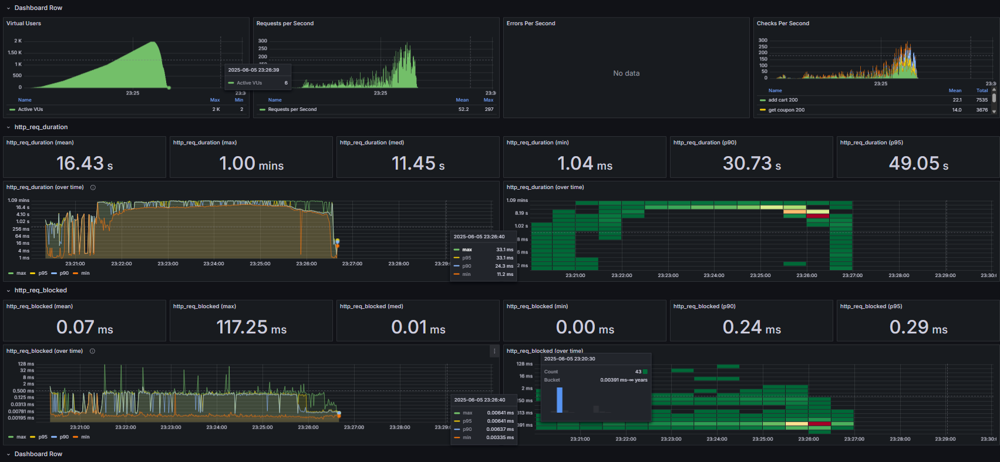
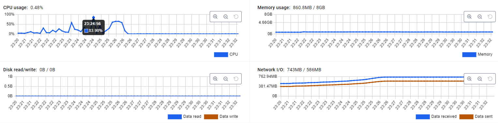
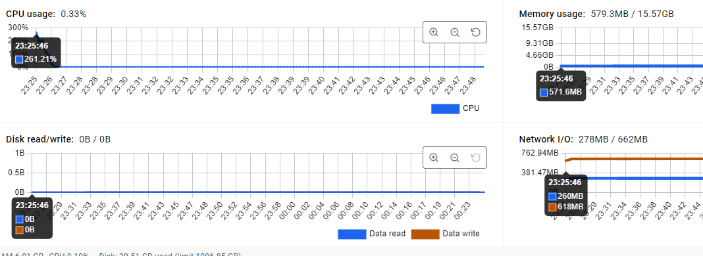
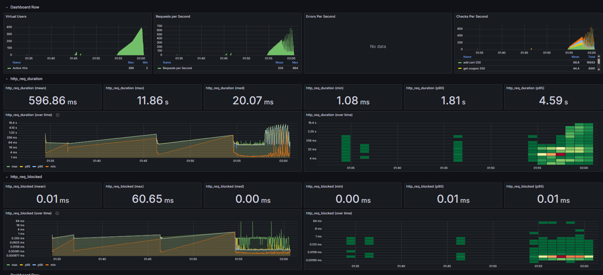
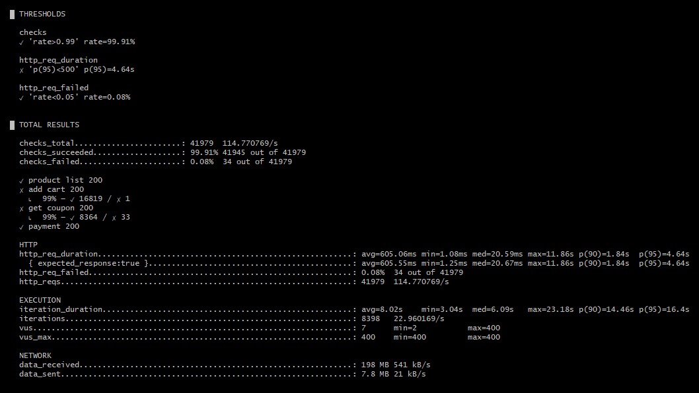
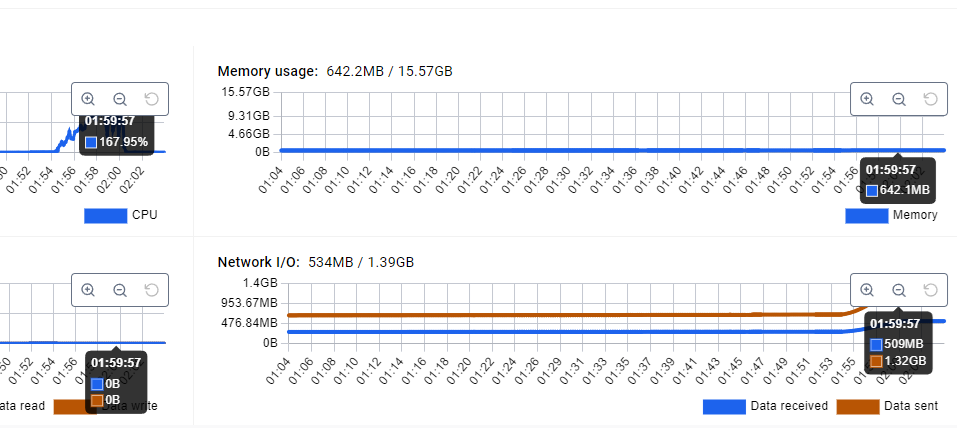

# 부하 테스트 결과

## 1. 부하 테스트 요약
| 항목                | 값                | 비고                                 |
| ----------------- |------------------|------------------------------------|
| **최대 VU**         | **2,000**        | 점진 증가 뒤 급감                         |
| **피크 RPS**        | **≈ 300 req/s**  | VU 대비 낮은 RPS → **대기행(Queue) 발생**   |
| **성공률(checks)**   | **97.15 %**      | 목표(rate > 99 %) **미달**             |
| **HTTP 실패율**      | **2.84 %**       | *product-list* API가 534 건(12 %) 실패 |
| **(성공) p95 지연**   | **32.43 s**      | SLA(500 ms) 대비 **65배 초과**          |
| **(전체) p95 지연**   | **49.06 s**      | 실패 포함 시 더 악화                       |
| **최대 지연**         | **60 s** (1 min) | 타임아웃 발생                            |
| **blocked time**  | 평균 0.07 ms       | 클라이언트 측 병목 없음                      |
| **iteration p95** | **152 s**        | 사용자 1회 플로우에 2 분 이상 소요              |


## 2. 테스트 결과
```text
  █ THRESHOLDS

    checks
    ✗ 'rate>0.99' rate=97.15%

    http_req_duration
    ✗ 'p(95)<500' p(95)=49.06s

    http_req_failed
    ✓ 'rate<0.05' rate=2.84%


  █ TOTAL RESULTS

    checks_total.......................: 19095  50.238635/s
    checks_succeeded...................: 97.15% 18551 out of 19095
    checks_failed......................: 2.84%  544 out of 19095

    ✗ product list 200
      ↳  87% — ✓ 3782 / ✗ 534
    ✓ add cart 200
    ✗ get coupon 200
      ↳  99% — ✓ 3676 / ✗ 10
    ✓ payment 200

    HTTP
    http_req_duration.......................................................: avg=16.42s min=1.03ms med=11.44s max=1m0s  p(90)=30.72s p(95)=49.06s
      { expected_response:true }............................................: avg=15.17s min=1.03ms med=11.16s max=1m0s  p(90)=28.24s p(95)=32.43s
    http_req_failed.........................................................: 2.84%  544 out of 19095
    http_reqs...............................................................: 19095  50.238635/s

    EXECUTION
    iteration_duration......................................................: avg=1m18s  min=4.51s  med=1m9s   max=3m18s p(90)=2m15s  p(95)=2m32s
    iterations..............................................................: 4101   10.789665/s
    vus.....................................................................: 6      min=2            max=2000
    vus_max.................................................................: 2000   min=2000         max=2000

    NETWORK
    data_received...........................................................: 90 MB  235 kB/s
    data_sent...............................................................: 3.6 MB 9.4 kB/s
```




## 3. 결과 분석
| 그래프                           | 관찰 내용                                            | 의미                                                  |
| ----------------------------- |--------------------------------------------------|-----------------------------------------------------|
| **RPS**                       | RPS 300 → **IO 대기 or Thread 고갈**로 사용자당 요청 빈도 급감  | 초당 300개의 request 를 처리하고, 그 이상의 request 는 timeout 발생 |
| **http\_req\_duration(over time)** | 21:21 \~ 23:26 구간 **p95≈33 s**로 평평 → 시스템 포화 후 지속 | 백엔드 자원(스레드·DB connection) 고갈 시 나타나는 패턴              |
| **p99/pmax = 60 s 컷**         | 거의 모든 극단치가 60 초 에서 잘림                            | 어플리케이션 timeout 60 초에 제한이 걸려있음                       |
| **Errors / Checks**           | product-list 87 % 성공, 나머지 13 %는 5xx/timeout 추정   | 같은 쿼리에 대한 락 경합·인덱스 미비 가능성                           |

### 3-1. 병목 지점 예측
1. DB Connection Pool
   - 최대 커넥션 < 동시 쿼리 → 큐 대기 → 요청 1건당 10 ~ 60 초 지연
2. Slow/Lock Query (product-list)
3. Redis 부하
   - 다중 MGET → CPU 단일 스레드 → coupon API만 간헐 실패
4. 어플리케이션 동시 Thread 초과 요청
   - 다른 요청은 큐 진입 후 60 초 이후 타임아웃

### 3-2. 분석된 병목지점 및 분석
1. Database peak 시 cpu 사용률 급증 (261.21%)
   - 무거운 쿼리가 원인으로 파악됨
   - product list 조회시 pagination 처리
     - id cursor 기반 조회로 변경하면 성능 향상 기대 가능
     - cpu 사용률 감소 기대 가능
2. 과도한 유저 설정
   - 처음 시도한 부하 테스트여서 그런지, 기대값이 너무 높았음.
     - 50, 300, 1000, 2000 vu 로 테스트는 너무 과도한 유저 설정이였음
     - 50, 100, 200, 300 vu 정도로만 잡아도, 충분히 성능 측정이 가능했을것으로 보임
   - 많은 유저수를 한번에 받게 되면, 서버 부하가 가중되는 결과 초래
3. 로그 분석 결과 **대부분의 경우** request timeout 이였음. 오류율은 3 % 미만.
4. 풀 사이즈 조정 → pagination 쿼리 개선 순으로 단계적으로 최적화 필요

### 3-3. 적정한 유저 수
결과 지표를 놓고 보았을때, 하나의 인스턴스가 감당 가능한 유저수는 250 ~ 300 vu 정도로 보임.

풀사이즈를 조정하고, pagination 쿼리 개선을 진행하면, 400 vu 까지 감당 가능할 것으로 사료됨

## 4. 풀사이즈 조정 및 pagination 쿼리 개선
```text
datasource:
 name: HangHaePlusDataSource
 type: com.zaxxer.hikari.HikariDataSource
 hikari:
   maximum-pool-size: 30
   connection-timeout: 10000
   max-lifetime: 1800000
   idle-timeout: 300000
```
- 풀 사이즈 조정 및 설정 조정

```text
server:
  tomcat:
    threads:
      max: 400
    accept-count: 200
```
- 톰캣 thread 수 조절


Product List 조회시, **pagination** 에서 **cursor** 기반 조회로 변경 

## 5. 개선사항 적용후, k6 테스트 재수행 결과




| 지표             | 이전(400 VU)     | **현재(400 VU)**       | 변화                            |
| -------------- | -------------- | -------------------- |-------------------------------|
| **피크 RPS**     | ≈ 300          | **≈ 680**            | ▲ **2.2 배**                   |
| **평균 응답(ms)**  | 3 600–16 000   | **≈ 600**            | **대폭 개선**                     |
| **p95 응답(ms)** | 7 000–49 000   | **4  640**           | ▼ 30–90 % (여전히 SLA 500 ms 초과) |
| **실패율**        | 0.18–2.84 %    | **0.08 %**           | 더욱 안정                         |
| **주 실패 API**   | `product-list` | **`get-coupon` 33건** | 병목 위치 변경                      |

> 요약: 커넥션 풀(30) + Tomcat 스레드(400) 확대 & 커서 기반 페이지네이션(인덱스 이용)이 처리량과 평균·p90 지연을 크게 줄임. 그러나 꼬리 지연(p95 4.6 s) 은 SLA(500 ms)를 아직 초과.

## 6. 결론
- pagination 개선으로 성능을 대폭 늘림
- 개선이전 300 vu 도 간신히 버티던 서비스가 거의 2.2배 가량 상승하여 400vu 는 거뜬히 버티는 서비스가 되었음
- 하지만 여전히 개선사항이 남아 있음

### 향후 계획
- DB 트랜잭션 로그 분석 및 병목 구간 최적화 진행
- get coupon 병목 확인 및 수정
- Auto Scaling 적용 여부 검토
- 600명 이상의 부하 테스트 진행 검토

---

## 7. 장애 대응 문서 (가상 - 일부 개선)
### 1. 장애 개요
- 발생 일시: 2025-06-06 01:58
- 장애 유형: 너무 많은 Request 로 인한 instance 과부화
- 영향 범위:
  - 상품 조회 timeout 발생
  - 홈페이지 응답 없음 발생

### 2. 장애 원인 분석
- 문제 원인
  - 과도한 유저가 집중되어, auto scaling 이 진행되기 전에 너무 많은 유저가 집중
  - db 에 집중되는 무거운 쿼리로 인한 db 풀 전부 소비

### 3. 장애 복구 후 개선 조치
- 상품 조회시 pagiable 로 처리되던 무거운 쿼리를 cursor 기반으로 변경
- Auto Scaling 적용 검토
  - 트래픽 증가 시 서버 자동 확장 가능 여부 검토
- 부하 테스트 및 모니터링 강화
  - K6 부하 테스트 재진행하여 성능 개선 확인