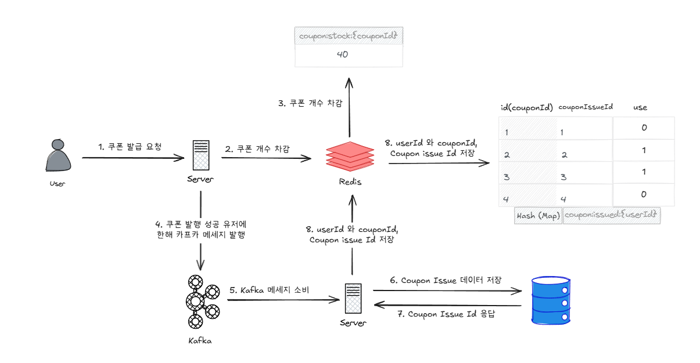
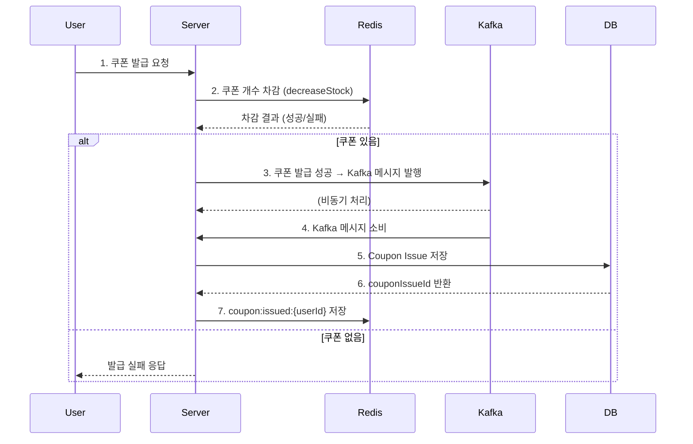
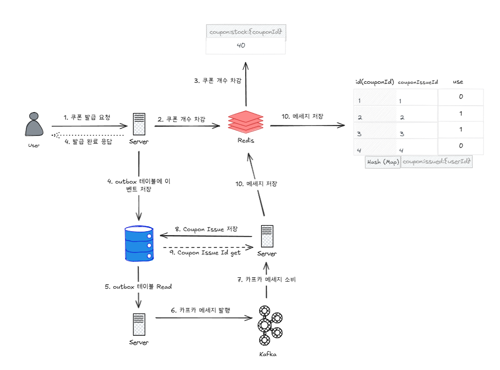
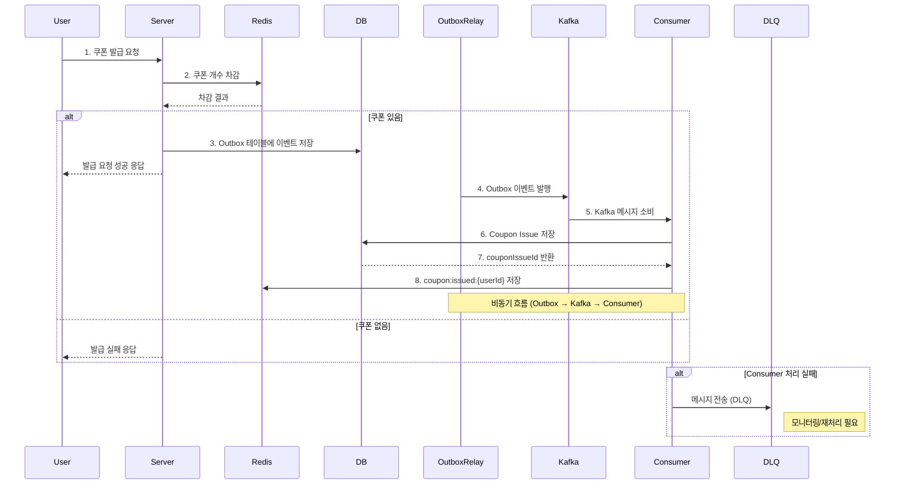
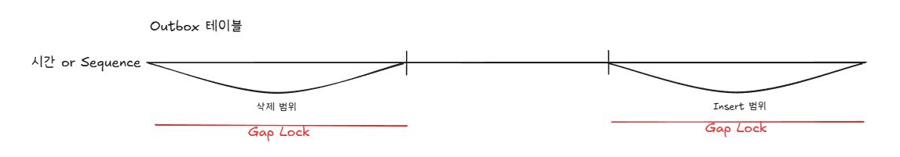

# Kafka 를 통한 이벤트 처리 구조 설계

## Outbox 패턴 적용 전
### 선착순 쿠폰 발급 전체 흐름도


### 선착순 쿠폰 발급 시퀀스 다이어그램


## Outbox 패턴 적용 후
### 선착순 쿠폰 발급 전체 흐름도


### 선착순 쿠폰 발급 시퀀스 다이어그램


# 설계 내용
## Kafka 를 도입 하기 전 문제점
- Redis 는 대표적인 Single Thread 모델로, 쿠폰 개수를 증가 / 차감 시키는 방법으로 동시성을 제어하고 데이터 일관성을 유지할 수 있음
- 모든 작업이 메모리 기반으로 이루어 지는 만큼, 빠른 속도를 보장함
- 구현이 단순함
- 트랜잭션 보장이 불완전 하고, 장애 시 데이터 유실 위험이 있음
- DB 와 비동기 일관성 유지가 어려움

## Redis + Kafka 구조
- Redis 에서 재고 차감 담당
- Kafka Consumer 가 DB 저장 및 Redis 이력을 저장 처리
- Redis 의 빠른 속도를 유지하면서 Kafka 의 비동기 처리 분기
- 이벤트 중심 아키텍처이므로, 확장성이 뛰어남 (MSA 구조 분해 용이)
- Kafka consumer 를 수행 도중 에러 발생할 시, 재시도 방법이 불분명함
  - 코드레벨에서 재시도 로직을 도입하는 방법을 고려 해야함
- **Kafka 처리 도중, 서버가 down 되면, 일관성이 깨질 가능성이 매우 큼**
- Kafka 발행과 DB 저장 간 트랜잭션이 존재하지 않음

## Redis + Kafka + Outbox 패턴 구조
- Redis 재고 차감 후 DB 에 Coupon 발급과 outbox Event 를 동시에 저장 (동일 트랜잭션으로 수행)
- 별도의 **Outbox Relay 서버**가 DB 의 outbox table 에서 kafka 메세지를 읽어서 message 발행
- 일관성 유지 및 장애 복구 가능
- 구현 복잡도가 복잡함
- outbox polling 이나 CDC 구성이 필요함
- 메세지 실시간성은 떨어지기 때문에, 성능적인 trade off 가 발생할 수 있음
- outbox 테이블은 일정 시간간격으로 정리하는 정책이 필요함

# 병렬성, 순차성, 중복 처리 전략
- Outbox 패턴의 안정적인 운영을 위해 병렬성, 순차성, 중복 처리 전략이 필수적으로 고려해야 함

## 병렬성
### 전략
- Outbox 레코드 상태를 저장하는 Status 값을 추가 (`Pending`, `Processing`, `Sent`, `Failed` 등)
  - 전송 프로세스 가장 처음에 `Processing` 으로 상태 변경
  - 전송이 끝나고나면, `Sent` 로 상태 변경
  - Multi-Thread 환경에서, 동시성 문제를 회피할 수 있음
- DB Lock 사용
  - `SELECT ... FOR UPDATE` 와 같은 방식을 사용하여 Outbox 행을 lock
### 위 전략을 사용하지 않으면..
- 여러 Thread 가 동일한 outbox record 에 접근할 수 있어, 동시에 여러 메세지가 처리 될 수 있다

## 순차성
### 전략
- Kafka 파티션 키 사용
  - 같은 userId 로 Kafka key 를 지정하면, 같은 파티션으로만 전송 -> Consumer 가 순차적으로 처리 보장
- Outbox 테이블에 timestamp 또는 Sequence 컬럼 추가
  - Consumer 에서 조회시, timestamp 나 sequence 컬럼으로 정렬하여 순서를 보장 할 수 있음
### 위 전략을 사용하지 않으면..
- 동일 Aggregate Root (ex. 같은 userId)에 대한 이벤트가 순서대로 처리되지 않으면 상태 비일관성 발생

## 중복 처리
### 전략
- 이벤트 ID 기반 중복 방지
  - outbox 에 uuid 기반 event id 저장
  - consumer 가 처리한 event id 는 별도 테이블 또는 redis 에 캐싱하여 중복 처리 방지
- Upsert 처리
  - `INSERT ... ON DUPLICATE KEY UPDATE` 와 같은 방식으로 동일 이벤트 중복 처리 방지
### 위 전략을 사용하지 않으면..
- kafka 재시도 or Consumer 재처리 등으로 인해 동일 이벤트가 중복 처리 될 가능성 존재


# Outbox 패턴에서 성능을 극대화 하는 방법

## 문제점
- outbox 테이블에는 빈번한 **INSERT** 와 **DELETE** 가 발생하게 된다
  - INSERT: 새로운 이벤트 발행시, 이벤트 Record 기록
  - DELETE: 이미 처리된 Message 나 처리가 불필요해진 Message 를 삭제 (용량 최적화 위함)
- INSERT 와 DELETE 시 DB Lock Waiting 문제가 발생할 수 있음

## 의문점
- 각각 하나의 row 를 Insert 하고, Delete 하는 것인데, 왜 DB Lock Waiting 문제가 발생하지?
- id 로 조회하면, 특정 row 단 하나만 특정해서 처리하게 되지 않나?

## 원인
- Mysql DB 의 `REPEATABLE READ` 격리 수준에서의 **Gap Lock**

### Gap Lock
- Mysql 에서 특정 row 에 대해 lock 을 잡을시, 해당 row 이외에 주위의 row 까지 범위로 lock 을 잡는 기법
- 다른 트랜잭션이 같은 인덱스 범위에 삽입하지 못하게 막기 위함
- 이렇게 하여 다른 트랜잭션에서의 `Phantom Read` 를 방지
  - Phantom Read: 트랜잭션 중 같은 조건으로 반복 조회 했을 때, 새로운 행이 나타나거나 사라지는 현상


## DB LOCK Wait 회피를 위해 취할 수 있는 방법
- Outbox 테이블 이외에, `processed_message` 와 같은 **처리된 message id** 를 보관할 새로운 테이블 생성
- message 를 정상적으로 발행하고 처리 완료된 message id 는 새로운 테이블에 보관
- 특정 주기 별로, 해당 테이블에 있는 id 로 outbox 테이블의 message 를 삭제 처리


```sql
DELETE FROM outbox WHERE id in (
    SELECT id FROM processed_message 
)
```
