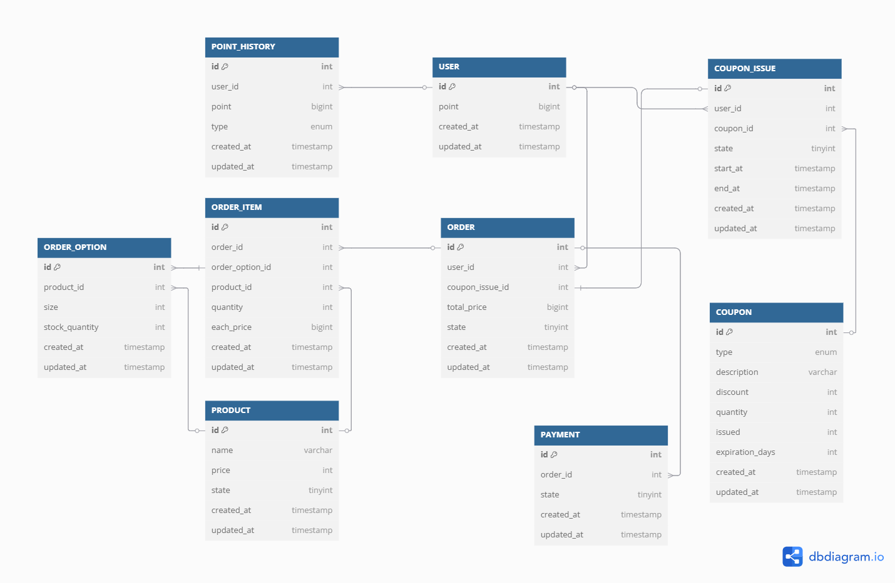

# ERD 설계

## ER 다이어그램

```
Table USER {
  id int [pk]
  point bigint
  created_at timestamp
  updated_at timestamp
}

Table POINT_HISTORY {
  id int [pk]
  user_id int [ref: > USER.id]
  point bigint
  type enum
  created_at timestamp
  updated_at timestamp
}

Table COUPON {
  id int [pk]
  type enum
  description varchar
  discount int
  quantity int
  issued int
  expiration_days int
  created_at timestamp
  updated_at timestamp
}

Table COUPON_ISSUE {
  id int [pk]
  user_id int [ref: > USER.id]
  coupon_id int [ref: > COUPON.id]
  state tinyint
  start_at timestamp
  end_at timestamp
  created_at timestamp
  updated_at timestamp
}

Table PRODUCT {
  id int [pk]
  name varchar
  price int
  total_stock int
  current_stock int
  state tinyint
  created_at timestamp
  updated_at timestamp
}

Table ORDER {
  id int [pk]
  user_id int [ref: > USER.id]
  coupon_issue_id int [ref: > COUPON_ISSUE.id]
  total_price bigint
  state tinyint
  created_at timestamp
  updated_at timestamp
}

Table ORDER_ITEM {
  id int [pk]
  user_id int [ref: > USER.id]
  order_id int [ref: > ORDER.id]
  product_id int [ref: > PRODUCT.id]
  each_price bigint
  quantity int
  created_at timestamp
  updated_at timestamp
}

Table PAYMENT {
  id int [pk]
  order_id int [ref: > "ORDER".id]
  state tinyint
  created_at timestamp
  updated_at timestamp
}
}
```

## 설계 내용

### USER
| 컬럼 이름     | 타입      | 제약 조건                     | 설명    |
|--------------|-----------|---------------------------|-------|
| id           | INT       | PK (Primary Key)          | 기본 키  |
| point        | BIGINT    | NOT NULL                  | 포인트 값 |
| created_at   | TIMESTAMP | DEFAULT CURRENT_TIMESTAMP | 생성 일시 |
| updated_at   | TIMESTAMP | ON UPDATE CURRENT_TIMESTAMP                          | 수정 일시 |


### POINT HISTORY
| 컬럼 이름     | 타입      | 제약 조건                                | 설명                        |
|--------------|-----------|--------------------------------------|-----------------------------|
| id           | INT       | PK                                   | 기본 키                      |
| user_id      | INT       | FK                                   | 사용자 ID (외래 키)          |
| point        | BIGINT    | NOT NULL                             | 포인트 값                    |
| type         | ENUM      | NOT NULL (`CHARGE`, `USE`, `REFUND`) | 포인트 사용 유형 (열거형)     |
| created_at   | TIMESTAMP | DEFAULT CURRENT_TIMESTAMP            | 생성 일시                    |
| updated_at   | TIMESTAMP | ON UPDATE CURRENT_TIMESTAMP          | 수정 일시                    |


### COUPON
| 컬럼 이름           | 타입        | 제약 조건                       | 설명                |
|-----------------|-----------|-----------------------------|-------------------|
| id              | INT       | PK                          | 기본 키              |
| type            | ENUM      | NOT NULL (`PERCENT`, `FIXED`) | 쿠폰 유형 (열거형)       |
| description     | VARCHAR   |                             | 쿠폰 설명             |
| discount        | INT       | NOT NULL                    | 할인 금액 또는 할인율      |
| quantity        | INT       | NOT NULL                    | 발행 가능 수량          |
| issued          | INT       | NOT NULL DEFAULT 0          | 현재까지 발행된 수량       |
| expiration_days | INT       | NOT NULL                    | 발행 후 유효 기간 (일 단위) |
| created_at      | TIMESTAMP | DEFAULT CURRENT_TIMESTAMP   | 생성 일시             |
| updated_at      | TIMESTAMP | ON UPDATE CURRENT_TIMESTAMP | 수정 일시             |


### COUPON ISSUE
| 컬럼 이름     | 타입      | 제약 조건                     | 설명                         |
|--------------|-----------|-------------------------------|----------------------------|
| id           | INT       | PK                             | 기본 키                       |
| user_id      | INT       | FK                             | 사용자 ID (외래 키)              |
| coupon_id    | INT       | FK                             | 쿠폰 ID (외래 키)               |
| state        | TINYINT   | NOT NULL                      | 쿠폰 상태 (-1: 만료, 0: 미사용, 1: 사용) |
| start_at     | TIMESTAMP |                               | 쿠폰 사용 시작 시간                |
| end_at       | TIMESTAMP |                               | 쿠폰 만료 시간                   |
| created_at   | TIMESTAMP | DEFAULT CURRENT_TIMESTAMP     | 생성 일시                      |
| updated_at   | TIMESTAMP | ON UPDATE CURRENT_TIMESTAMP   | 수정 일시                      |


### PRODUCT
| 컬럼 이름         | 타입      | 제약 조건                     | 설명                                     |
|---------------|-----------|-------------------------------|----------------------------------------|
| id            | INT       | PK                             | 기본 키                                   |
| name          | VARCHAR   | NOT NULL                      | 상품 이름                                  |
| price         | INT       | NOT NULL                      | 상품 가격 (단위: 원)                          |
| total_stock   | INT       | NOT NULL                      | 상품 전체 재고                              |
| current_stock | INT       | NOT NULL                      | 현재 재고                                 |
| state         | TINYINT   | NOT NULL                      | 상품 상태 (-1: 삭제, 1: 판매중, 2: 품절, 3: 숨김 등) |
| created_at    | TIMESTAMP | DEFAULT CURRENT_TIMESTAMP     | 생성 일시                                  |
| updated_at    | TIMESTAMP | ON UPDATE CURRENT_TIMESTAMP   | 수정 일시                                  |


### ORDER
| 컬럼 이름         | 타입      | 제약 조건                       | 설명                                    |
|------------------|-----------|-----------------------------|---------------------------------------|
| id               | INT       | PK                          | 기본 키                                  |
| user_id          | INT       | FK                          | 사용자 ID (외래 키)                         |
| coupon_issue_id  | INT       | FK, NULL                    | 발급된 쿠폰 ID (외래 키), 선택 가능               |
| total_price      | BIGINT    | NOT NULL                    | 총 결제 금액 (할인 반영 후)                     |
| state            | TINYINT   | NOT NULL                    | 주문 상태 (-1: 주문 취소, 0: 주문 대기, 1: 주문 완료) |
| created_at       | TIMESTAMP | DEFAULT CURRENT_TIMESTAMP   | 생성 일시                                 |
| updated_at       | TIMESTAMP | ON UPDATE CURRENT_TIMESTAMP | 수정 일시                                 |

### ORDER ITEM
| 컬럼 이름      | 타입      | 제약 조건                       | 설명              |
|------------|-----------|-----------------------------|-----------------|
| id         | INT       | PK                          | 기본 키            |
| user_id   | INT       | FK                          | 사용자 ID (외래 키)     |
| order_id   | INT       | FK, NULL                        | 주문 ID (외래 키)    |
| product_id | INT       | FK                          | 상품 ID (외래 키)    |
| each_price | BIGINT    | NOT NULL                    | 상품 1개에 대한 단위 가격 |
| quantity   | INT   | NOT NULL                    | 주문 수량           |
| created_at | TIMESTAMP | DEFAULT CURRENT_TIMESTAMP   | 생성 일시           |
| updated_at | TIMESTAMP | ON UPDATE CURRENT_TIMESTAMP | 수정 일시           |
설명 : 장바구니 역할. 주문 상태에 들어가면 그 때, order_id 를 update 시켜준다.

### PAYMENT
| 컬럼 이름     | 타입      | 제약 조건                    | 설명                                    |
|--------------|-----------|------------------------------|---------------------------------------|
| id           | INT       | PK                            | 기본 키                                  |
| order_id     | INT       | FK                  | 주문 ID (외래 키)                          |
| state        | TINYINT   | NOT NULL                     | 상태 코드 (-1: 결제 취소, 0: 결제 대기, 1: 결제 완료) |
| created_at   | TIMESTAMP | DEFAULT CURRENT_TIMESTAMP    | 생성 일시                                 |
| updated_at   | TIMESTAMP | ON UPDATE CURRENT_TIMESTAMP  | 수정 일시                                 |
