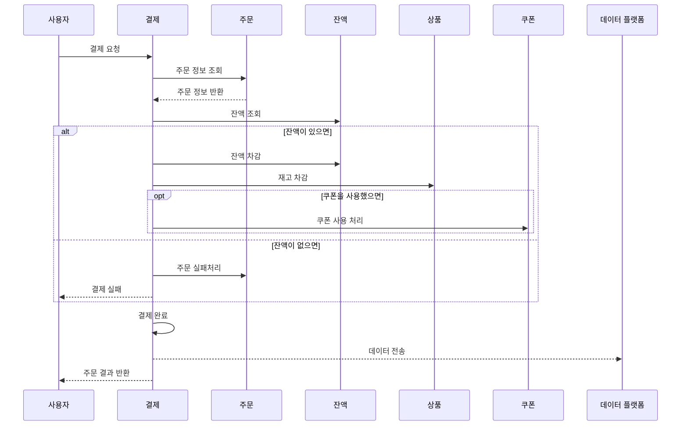
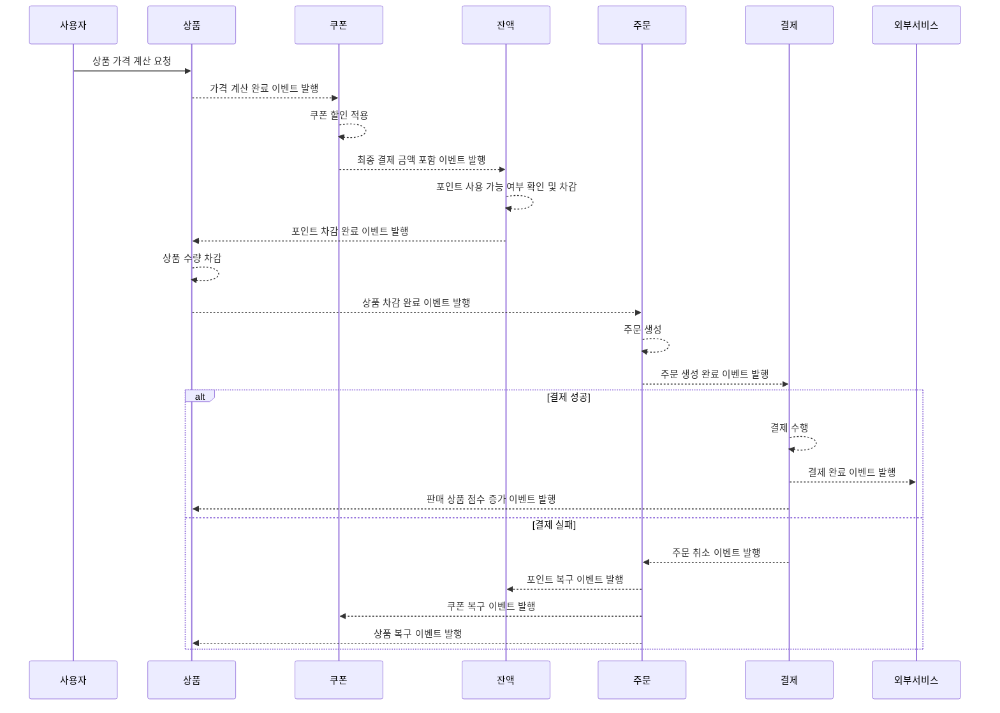

# MSA 아키텍처 조사 및 설계

# 1. 배경
2주차부터 7주차까지 진행된 이커머스 시스템은 도메인 중심의 **클린 아키텍처 기반 모놀리식 구조**로 개발되었다.

하지만 시스템 규모가 커지고, 도메인 간 의존성과 책임 분리가 복잡해짐에 따라  
다음과 같은 구조적 문제들이 발생할 수 있다:

## 예상되는 문제점

- 다양한 상태 변경 로직이 **하나의 트랜잭션** 안에서 처리됨
  > 예: 포인트 차감, 재고 감소, 쿠폰 사용 등이 모두 하나의 트랜잭션으로 묶임
- 도메인 간 **높은 결합도**
  > 주문 처리 중 하나의 도메인이 실패하면 전체 트랜잭션이 롤백되는 구조
- 복잡한 연관성으로 인해 **재사용성 / 확장성 / 테스트 용이성**이 떨어짐
  > 예: 주문 도메인을 테스트하려 해도 결제, 재고 도메인까지 함께 구성되어야 테스트 가능
- **확장성 한계**
  > 고부하 상황에서도 단일 인스턴스에 모든 책임이 집중되며,  
  > 특정 도메인만 스케일아웃이 불가능한 구조

이러한 문제를 해결하고 향후 유지보수성과 확장성을 고려하여  
이번 과제에서는 **마이크로서비스 아키텍처(MSA)** 기반으로 시스템을 재설계하고자 한다.

---

# 2. 문제 정의

## 모노리식의 단점
1. **예상치 못한 결합**
    - 초기 설계에서는 의도하지 않았으나, 도메인 간 암묵적인 결합이 발생할 수 있음
    - 이로 인해 기능 수정 시 연쇄적인 영향이 발생
2. **테스트 비용 증가**
    - 위와 같은 결합으로 인해, A 서비스를 수정했을 때 B 서비스까지 함께 테스트해야 하는 상황이 발생
    - 도메인 단위 테스트가 어려워짐
3. **높은 출시 사이클**
    - 부분적인 수정도 전체 시스템에 영향을 미치므로 QA 범위가 넓어짐
    - 전체 애플리케이션에 대한 테스트 및 검증이 필요하여 릴리즈가 지연됨
4. **부족한 장애 내성**
    - 모든 기능이 하나의 프로세스에 통합되어 실행되기 때문에, 특정 기능에서 발생한 오류가 전체 시스템 장애로 확산될 위험이 있음
    - 부분적인 장애임에도 전체 애플리케이션의 가용성이 크게 떨어질 수 있음
5. **단일 확장성(수평 확장 한계)**
    - 서비스 확장 시 전체 시스템을 복제하여 수평 확장하는 방식밖에 없음
    - 특정 도메인만 부하가 높아도 전체 인스턴스를 늘려야 하는 비효율 발생

---

# 3. 목표
현재 시스템은 도메인 주도 설계(DDD) 원칙에 따라 각 도메인이 구분되어 있으며, 이로 인해 기능별 책임이 잘 나누어져 있다.  
다만, 개인적인 역량의 한계로 인해 일부 도메인 간 결합이 존재하며, 이는 DDD 원칙을 완전히 지키지 못한 부분이다.  
이러한 결합은 향후 리팩토링을 통해 개선할 예정이며, 특히 `OrderFacade`와 `PaymentFacade` 간의 강한 결합을 분리할 필요성이 있다.

또한 코드 구조가 **모놀리식(Monolithic)**으로 구성되어 있기 때문에, 모든 도메인이 하나의 서비스 안에 통합되어 있어  
앞서 정의한 문제들(결합, 배포 지연, 장애 전파 등)이 그대로 발생하고 있다.

이에 따라 본 과제의 목표는 기존 시스템을 **마이크로서비스 아키텍처(MSA)** 기반으로 재설계하는 것이다.
- **8주차**에는 Spring의 **ApplicationEvent**를 활용하여 도메인 간 비동기 분리를 시도하고,
- **9주차**에는 **Kafka**를 도입하여 이벤트 기반 통신 구조를 실제 메시지 브로커로 전환할 계획이다.

## 시스템 전환 목표

### 1. **도메인 중심의 마이크로서비스 분리**
- 현재 도메인 단위로 구분된 DDD 구조를 기반으로, 각 도메인을 **독립적인 서비스 단위**로 전환
- 예: 주문 도메인 → `OrderService`, 결제 도메인 → `PaymentService`

### 2. **도메인 간 통신을 이벤트 기반으로 설계**
- 서비스 간 직접 호출 대신 **비동기 이벤트**로 연결하여 결합도를 낮추고 장애 격리성 확보
- 예시 흐름:
    ```
    포인트 서비스 → (주문 이벤트 발행) →
    주문 서비스 → (결제 요청 이벤트 발행) →
    결제 서비스 처리 → (결제 완료 이벤트 발행)
    ```
### 3. **독립적인 배포 및 운영이 가능한 구조 설계**
- 각 서비스는 **개별적으로 배포, 확장** 가능
- 특정 도메인에 병목 발생 시 해당 서비스만 **스케일 아웃** 가능
- 단, 항해 프로젝트 특성상 실제 코드 분리는 수행하지 않고,
    - **분리 가능한 구조로 개발**하여 MSA 개념 학습에 중점을 둠
    - 실서비스가 아니기 때문에 자원 부족 상황이 발생하지 않으며,
    - 프로젝트 전환 시 **확장 가능성 확보**를 목표로 함

### 4. **복잡한 트랜잭션 처리: SAGA 패턴 적용**
- 기존 모놀리식에서 하나의 DB 트랜잭션으로 묶인 흐름을 **분산 트랜잭션(SAGA)**으로 재구성
- 보상 트랜잭션을 활용하여 **트랜잭션 실패 시 롤백 로직** 구현 예정

#### 5. **서비스 장애 시 전체 시스템 영향 최소화**
- 서비스 간 분리로 인해 **한 도메인 장애가 전체 시스템으로 확산되지 않도록 격리 설계**
- 예: 결제 서비스가 일시 중단되어도 주문 조회나 포인트 기능은 정상적으로 동작해야 함

---

# 4. AS-IS 구조


※ 본 차트는 2주차에 설계한 차트로, 현재의 구조와 다소 차이가 있을 수 있음

현재 시스템은 **클린 아키텍처 기반의 모놀리식 구조**로 구성되어 있으며,  
도메인 주도 설계(DDD)를 도입하여 `Order`, `Payment`, `Coupon`, `Point`, `Product` 등 주요 도메인 간의 책임을 구분하였다.

## 구성 방식

- 모든 도메인은 **하나의 Spring Boot 애플리케이션 내에 통합**
- 내부 레이어는 다음과 같은 구조로 구성:
> Controller → Facade → Service → Repository → DB
- 도메인 간 호출은 대부분 **직접 참조**를 통해 이루어지며,  
  하나의 기능 흐름에서 여러 도메인의 메서드를 **직렬로 호출**하는 방식

### 예시: 주문 생성 시 전체 처리 흐름
```
1. 주문 요청 수신 (`OrderController`)
2. 포인트 차감 (`PointService`)
3. 쿠폰 사용 처리 (`CouponService`)
4. 재고 차감 (`InventoryService`)
5. 결제 요청 (`PaymentService`)
6. 주문 정보 저장 (`OrderService`)
```
> 모든 단계는 **하나의 트랜잭션 범위 내**에서 처리됨

## 현재 구조의 한계

| 항목 | 설명 |
|------|------|
| **강한 결합** | 서비스 간 직접 호출로 인해 도메인 간 결합도 높음 |
| **트랜잭션 일체화** | 모든 상태 변경 로직이 단일 트랜잭션으로 묶임 |
| **부분 장애 불가능** | 한 기능 실패 시 전체 롤백 (ex. 재고 차감 실패 → 결제 취소 불가) |
| **독립 배포 불가** | 하나의 모듈만 변경하더라도 전체 애플리케이션 재배포 필요 |
| **스케일 아웃 한계** | 특정 도메인에만 부하가 몰려도 전체 인스턴스 확장해야 함 |

---

# 5. TO-BE 구조

현재 시스템의 도메인 구분은 DDD 원칙을 기반으로 나뉘어 있으므로, 
이를 기반으로 서비스 단위로 분리하고, 도메인 간 통신을 **비동기 이벤트 기반**으로 
구성하여 MSA 구조에 적합한 아키텍처로 전환하고자 한다.

## 서비스 분리 기준

서비스는 다음 기준에 따라 분리한다:

- **도메인 책임과 경계를 기준으로 분리**
    - 예: 주문 생성, 결제, 포인트 차감, 쿠폰 사용, 재고 감소 등은 각각 독립된 도메인 로직을 가지며, 변경 주기도 상이
- **트랜잭션 경계를 기준으로 분리**
    - 하나의 트랜잭션에 종속되어야 하는 로직은 한 서비스에 묶되, 외부 서비스 호출은 이벤트 처리로 전환
- **확장성과 독립 배포 가능성을 고려한 분리**
    - 서비스별로 독립 배포가 가능하도록 구조 설계
    - 특정 서비스에만 부하가 집중될 경우, 해당 서비스만 수평 확장 가능해야 함

## 예상되는 서비스 구조

도메인 단위로 다음과 같이 서비스를 분리한다:

| 서비스 이름 | 주요 책임 |
|-------------|-----------|
| **Order Service** | 주문 요청 수신, 주문 상태 관리, 이벤트 흐름 제어 |
| **Point Service** | 사용자 포인트 차감/적립 처리 |
| **Coupon Service** | 쿠폰 사용 처리, 유효성 검증, 보상 로직 |
| **Inventory Service** | 재고 차감 및 검증 |
| **Payment Service** | 결제 요청 처리 및 결제 완료 응답 |

## 구조적 특징

- 각 서비스는 내부적으로는 **로컬 트랜잭션**으로 처리하고,
- 외부 서비스와의 연동은 **Kafka 이벤트 발행/구독 방식**으로 연결
- 실패 시 각 서비스는 **보상 트랜잭션**을 실행하여 SAGA 패턴을 완성

## 보상 트랜잭션 설계

| 서비스 | 정상 처리 | 보상 트랜잭션 |
|--------|------------|----------------|
| **Coupon Service** | 쿠폰 사용 | 쿠폰 복구 (`CouponRollbackEvent`) |
| **Point Service** | 포인트 차감 | 포인트 복구 (`PointRollbackEvent`) |
| **Order Service** | 주문 생성 | 주문 취소 (`OrderCancelEvent`) |
| **Payment Service** | 결제 완료 | 없음 (결제는 외부 시스템, 취소 불가 시 관리자 대응 필요) |

### 보상 트랜잭션 처리 방식

- 모든 보상 이벤트는 **이벤트 메시지로 발행**되어 해당 서비스에서 구독 후 처리
- 각 도메인은 자신이 발행한 보상 이벤트에 대해서만 책임을 가짐
- 이벤트 손실/중복 처리를 방지하기 위해 **Idempotency** 보장 필요
    - 예: 포인트 복구는 한 번만 실행되도록 처리

---

# 6. 트랜잭션 처리 전략

## 6.1 2PC의 원리 및 한계
### 2PC (Two-Phase Commit)란?
분산된 시스템에서 하나의 트랜잭션처럼 로직을 수행하고, **원자성(Atomicity)**을 보장하기 위한 프로토콜  
주로 **Coordinator**와 **Participant(참여자)** 구조로 구성됨

### 트랜잭션 처리 흐름
**분산된 서버 / 분산된 DB 환경에서의 트랜잭션 처리 순서:**
1. **Prepare 단계**
    - `Coordinator 서버`가 모든 `Participant 서버`에게 **트랜잭션 시작 및 로직 실행 요청**을 전송
2. **로직 실행**
    - 각 Participant는 로컬 로직을 실행하고, 성공 여부를 Coordinator에게 보고
3. **Rollback 처리**
    - 하나라도 실패 시, Coordinator는 모든 서버에 **rollback** 명령 전송
4. **Commit 처리**
    - 모든 서버가 성공했다고 보고하면, Coordinator는 **commit** 명령 전송

### 2PC의 한계 및 단점
- **네트워크 비용 증가**
    - 각 단계마다 API 호출 또는 이벤트 생성/수신 발생 → 통신 오버헤드 증가
- **DB Lock 유지 시간 증가**
    - 각 Participant의 DB는 `commit` 이벤트를 받을 때까지 **트랜잭션을 열린 상태로 유지**
    - → 하나라도 느려지면 전체 성능 저하
- **Coordinator 블로킹**
    - 하나의 Participant가 응답하지 않으면, Coordinator는 대기 상태로 블로킹
- **단일 장애점 (SPOF)**
    - Coordinator나 Participant 중 하나라도 장애 발생 시 → 전체 트랜잭션 실패
- **MSA 철학과 충돌**
    - 마이크로서비스는 자율성과 비동기 메시징을 지향
    - 2PC는 **동기적, 중앙 제어 방식**이므로 MSA에 부적합

> ❌ **위와 같은 단점들로 인해 2PC는 실무에서 거의 사용되지 않음.**  
> 대부분은 **SAGA 패턴**이나 **이벤트 기반 처리**로 대체.

## 6.2 SAGA 패턴

### SAGA란?
SAGA는 **분산 트랜잭션을 다루기 위한 패턴**으로, 각 서비스가 **자신의 로컬 트랜잭션을 실행한 후**,    
성공 여부에 따라 다음 서비스로 진행하거나 **보상 트랜잭션(Compensation)** 을 수행하는 방식

> 단일 트랜잭션을 유지하지 않고, 각 서비스의 **로컬 트랜잭션을 순차적으로 실행**하고 실패 시 **역방향으로 취소**

### SAGA의 두 가지 구현 방식
#### 1. Choreography

- 각 서비스가 이벤트를 발행하고, 다른 서비스는 이를 구독하여 처리
- 흐름 제어자 없음 (조율 없이 서비스 간 연결됨)

**예시:**
```
OrderService → (주문 생성 이벤트) →  
→ PaymentService → (결제 완료 이벤트) →  
→ InventoryService → (재고 차감 이벤트)
```  

**장점:**
- 구현이 간단하고 빠름
- 중앙 제어자 불필요

**단점:**
- 흐름이 분산되어 추적 어려움
- 서비스가 많아질수록 이벤트 복잡성 증가 ("이벤트 지옥")

#### 2. Orchestration (오케스트레이션: 중앙 제어 방식)

- **Saga Orchestrator**가 전체 프로세스를 조율
- 각 서비스는 Orchestrator 의 요청에 따라 로직을 실행하고 응답만 함

**예시:**  
```
SagaOrchestrator →  
→ OrderService (주문 생성) →  
→ PaymentService (결제 요청) →  
→ InventoryService (재고 차감)
```

**장점:**
- 로직과 흐름이 명확함
- 실패 시 보상 로직을 중앙에서 제어 가능

**단점:**
- Orchestrator 자체의 복잡도 증가
- 중앙 집중 구조로 설계가 필요
- 이벤트 발생 수가 Choreography 방식에 비해 훨씬 많음
  - 이에 따라 Orchestrator 나 Kafka 같은 서버에 부하가 증가함 

### Choreography vs Orchestration 요약 비교

| 항목 | Choreography | Orchestration |
|------|--------------|----------------|
| 구조 | 이벤트 기반 | 중앙 집중 제어 |
| 흐름 제어 | 없음 (분산) | Orchestrator가 전담 |
| 구현 난이도 | 간단 | 상대적으로 복잡 |
| 확장성 | 서비스 많아지면 복잡 | 로직이 중앙에 집중되어 유지보수 용이 |
| 장애 대응 | 분산되어 어려움 | 흐름이 명확해 보상 처리 용이 |
| 실무 적합도 | 간단한 흐름에 적합 | 복잡한 비즈니스에 적합 |

## 6.3 왜 SAGA를 선택하는가
### SAGA 선택 이유

1. **비동기 처리 가능**
    - 서비스 간 느슨한 결합 유지
    - 성능 저하 없이 분산 트랜잭션 구성 가능
2. **부분 성공 및 보상 처리 가능**
    - 실패한 서비스만 선택적으로 롤백
    - 전체 서비스 롤백이 아닌 유연한 오류 복구 가능
3. **서비스 장애 격리 가능**
    - 하나의 서비스 장애가 전체 서비스 중단으로 이어지지 않음
    - 장애 내성이 높아지고 복구가 쉬워짐
4. **MSA 철학과 일치**
    - 각 서비스는 로컬 트랜잭션만 신경 쓰면 됨
    - 자율적인 배포 및 독립적인 서비스 유지 가능
5. **장기적으로 운영/관리가 쉬움**
    - 서비스 상태 추적 및 장애 대응 용이

## 6.4 실무에서 사용하는 패턴
실무에서는 마이크로서비스 간의 분산 트랜잭션 처리 시  
**Choreography 방식의 SAGA 패턴을 더 자주 사용**하며,  
**Orchestration 방식은 거의 사용하지 않는 편**이다.

1. **Orchestration 방식은 이벤트가 두 배로 발생함**
    - Orchestrator가 각 서비스를 호출하고, 각 서비스가 응답하면 다음 호출로 이어가는 방식이기 때문에
    - 각 단계마다 **요청 이벤트 + 응답 이벤트**가 존재
    - → Kafka 등 메시지 브로커에 **불필요하게 많은 이벤트가 발생**하여 부하를 유발할 수 있음

2. **실무에서는 트랜잭션 깊이(depth)가 제한적임**
    - 일반적으로 3~4단계 내외로 충분한 경우가 많음 (예: 주문 → 결제 → 재고 → 쿠폰)
    - 국내 대부분의 서비스에서는 이 이상 복잡한 분산 트랜잭션이 필요하지 않음
    - **Amazon, Netflix** 등 글로벌 초대형 플랫폼이라면 더 깊은 트랜잭션 흐름이 존재할 수 있으나,
      일반적인 국내 서비스 규모에서는 **Orchestration까지 사용할 이유가 크지 않음**

> 대부분의 국내 실무 서비스에서는  
> **트랜잭션 흐름이 3~4단계 이내이며**,  
> Kafka 부하와 도입 복잡성을 고려할 때  
> **Choreography 방식이 더 간결하고 현실적인 선택**이다.

Orchestration은 상태 전이 추적이 명확하고 복잡한 분기 처리에 유리하긴 하나,  
**트래픽, 도입 난이도, 운영 오버헤드**를 고려하면  
**초대형 글로벌 서비스가 아닌 이상 굳이 도입할 필요는 없다.**

---

# 7. 서비스 간 통신 방식

## 점진적 이벤트 기반 통신 전환

이번 과제에서는 MSA 아키텍처에서의 도메인 간 통신을 단계적으로 실습하기 위해 다음과 같은 방식으로 이벤트 시스템을 구성하였다:

### 8주차: Spring 어플리케이션 비동기 이벤트

- **목표**: 마이크로서비스 구조로 전환하기 전에, 기존 모놀리식 내부에서 도메인 간 결합을 줄이고  
  **비동기 이벤트 기반 통신 구조**를 실습

- **구현 방식**:
    - Spring의 `ApplicationEventPublisher`와 `@TransactionalEventListener` 사용
    - 도메인 간 직접 메서드 호출 대신, 이벤트를 발행하고 해당 도메인을 구독하는 구조로 분리

- **장점**:
  - 코드 레벨에서 결합도를 낮추고 이벤트 흐름 연습 가능
  - 구현이 간단하고 빠르게 적용 가능

- **한계**:
  - 같은 JVM 내에서만 작동 → 서비스가 분리되면 사용 불가
  - 메시지 중간 저장, 재처리, 장애 복구 기능 없음


### 9주차: Kafka 기반 이벤트 통신

- **목표**: 실제 MSA 환경과 유사한 **분산 메시징 시스템 기반 통신 구조**로 전환

- **구현 방식**:
  - Kafka Producer 를 통해 이벤트 발행
  - 각 도메인 서비스는 Kafka Consumer 로서 이벤트를 구독하고 자체 로직 수행

- **장점**:
  - 서비스 간 **비동기, 느슨한 결합** 가능
  - 장애 격리 및 메시지 재처리 가능
  - 확장성과 운영 편의성 확보

- **한계**:
  - 초기 구성 복잡 (Kafka 브로커, 토픽 설계 필요)
  - 운영 및 모니터링에 추가 부담

> 현재는 도메인 간 이벤트 구조를 **Spring 이벤트로 설계**하되,  
> 이후 **Kafka로 전환이 가능한 구조로 개발**함으로써,  
> MSA의 핵심 개념인 **비동기 메시지 기반 통신과 결합도 최소화**

---
# 8. 참고 사례: 우아한 모노리스
우아한형제들의 박용권님은 '우아한 모노리스' 발표에서 마이크로서비스 아키텍처(MSA)에서 
모놀리식 아키텍처로의 회귀를 통해 기술 부채를 해결한 경험을 공유하였습니다. 
이 발표에서는 모듈화된 모놀리식 구조의 장점과 이를 구현하는 방법에 대해 다루고 있습니다.

## 8.1 MSA에서 모놀리식으로의 회귀 이유
- 기술 부채 증가
  - 공유된 데이터 원본으로 인해 스키마 변경이 여러 서비스에 영향을 미치고, 이로 인해 장애가 발생하는 등 기술 부채가 증가
- 조직과 시스템의 불일치
  - 소규모 개발팀이 여러 서비스를 관리하면서, 요구사항을 빠르게 반영하기 위해 임시방편으로 코드를 작성하게 되었고, 이는 기술 부채를 가속화
- 운영의 복잡성
  - 서비스가 분산되면서 배포 및 운영의 복잡성이 증가하였고, 이는 시스템의 안정성을 저하

## 8.2 모듈화된 모놀리식 아키텍처의 구현
- 멀티 모듈 구성
  - 도메인 중심으로 모듈을 구성하여, 각 모듈이 독립적으로 개발되고 테스트될 수 있도록 개발
- 스프링의 계층적 ApplicationContext 활용
  - 스프링의 계층적 ApplicationContext를 활용하여 모듈 간의 의존성을 관리하고, 모듈의 자율성을 확보
- 공개 인터페이스를 통한 모듈 간 통신
  - 모듈 간의 통신은 공개된 인터페이스를 통해 이루어지며, 이를 통해 모듈 간의 결합도를 낮추고 응집도를 높임

## 8.3 모놀리식 아키텍처의 장점
- 단순한 배포와 운영
  - 하나의 애플리케이션으로 구성되어 있어 배포와 운영이 단순하며, 이는 시스템의 안정성을 높임
- 빠른 개발 속도
  - 모듈 간의 통합이 용이하여, 새로운 기능의 개발과 배포가 빠르게 이루어짐
- 낮은 복잡성
  - 서비스 간의 통신이 내부 메서드 호출로 이루어져 네트워크 지연이나 장애에 대한 걱정이 줄어듦

## 8.4 결론
모놀리식 아키텍처는 초기 개발 속도와 운영의 단순성 측면에서 장점이 있으며, 시스템의 규모와 팀의 역량에 따라 적절한 아키텍처를 선택하는 것이 중요  
모듈화된 모놀리식 아키텍처는 MSA의 복잡성을 줄이면서도 모듈 간의 독립성을 확보할 수 있는 대안이 될 수 있음  

이 세미나를 보고나서, 단순히 MSA 구조 짱! MSA 신격화! 이런 생각을 하는것보다 회사의 상황에 맞게, 유동적으로 설계할 수 있는 능력을 갖춘 개발자가 되는게 중요하다고 느낌


# Reference
- [박용권 - 우아한 모노리스 유튜브](https://www.youtube.com/watch?v=SrQeIz3gXZg)
- [우아한 모노리스 블로그 정리글](https://developer-cheol.tistory.com/115)
- 콘웨이 법칙 : 프로그램의 구조는 그것을 제작하는 조직의 구조 혹은 의사소통 방식을 반영한다
