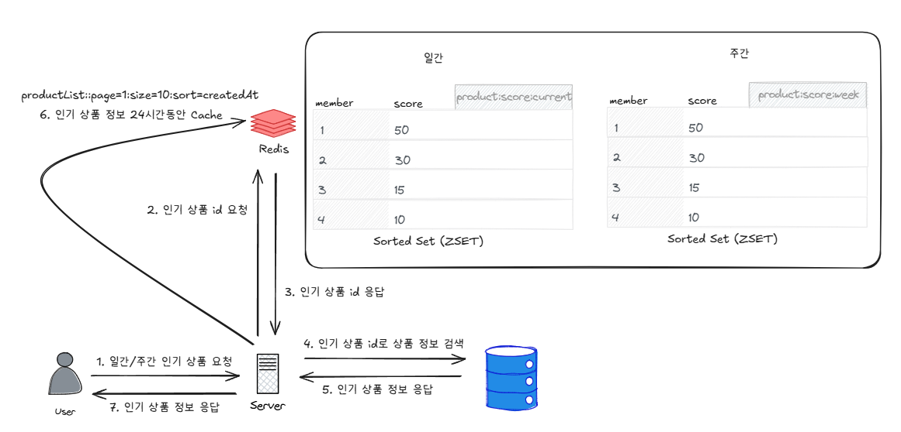
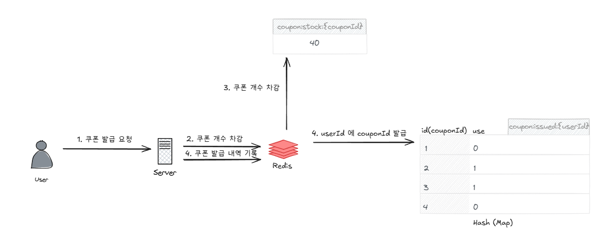
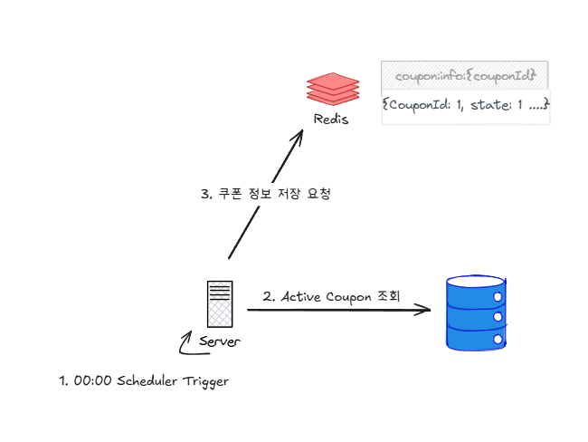
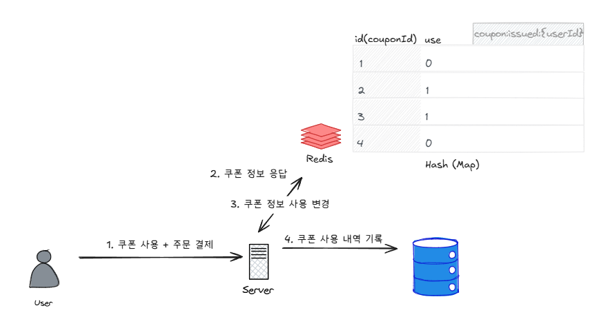

# Redis 디자인 아키텍처 보고서

## Redis 설계 적용 대상
### 인기 상품 조회
기존에는 매일 상당한 시간이 걸리는 쿼리를 돌려서 redis 캐시에 저장하고 이를 전달하도록 하였음  
당연하게도, DB 계산에 상당한 부하가 걸리게 되고, 따로 통계 테이블을 두지 않았기 때문에, 조회하고자 하는 기간이 길어질수록 조회 딜레이가 길어지고, DB CPU 부하가 심해지게 된다  
Redis 에서 상품 판매 랭킹 집계, 조회를 지원하여, 고성능으로 cpu 를 최대한 덜 사용하는 방향으로 인기 상품을 이용자에게 보여주고자 한다.

### 선착순 쿠폰 발급 및 조회
선착순 쿠폰은 단시간에 상당히 많은 유저가 몰려서 서버와 DB 인스턴스에 부하를 줄 수 있었다. 동시성 제어를 하기 위해 락을 사용하였고, 이는 당연하게도 성능 저하로 이어지게 된다.  
게다가, 락을 사용하는동안, 다른 서비스도 락에 영향을 받으므로, 전반적인 성능에 영향을 미친다  
Redis 의 자료구조를 적극적으로 활용하여, 락에서 자유로운 서버를 만들고, 동시성 이슈가 없도록 쿠폰을 빠르게 원하는 수량만 제공하도록 설계한다

## 랭킹 디자인 설계
**랭킹 시스템은 "어제 집계 결과" 를 유저에게 노출**
### 랭킹 자료구조
| Redis Key 형태                 | 설명                | 자료구조 (Redis 타입)       | 비고                   |
|:-----------------------------|:------------------| :-------------------- |:---------------------|
| `product:score:current`      | 상품 당일 점수 (집계용)    | **Sorted Set (ZSET)** | 유저에게 직접 노출되지 않음  |
| `product:score:{yyyy-MM-dd}` | 상품 일간 판매 점수 (노출용) | **Sorted Set (ZSET)** | 상품 ID를 score 기준으로 정렬 |
| `product:score:week`         | 상품 주간 판매 점수 (노출용) | **Sorted Set (ZSET)** | 상품 ID를 score 기준으로 정렬 |

### 일간 랭킹 설계

- 매일 23:50 스케줄러 동작
    - current -> today 로 복제
        - today 데이터는 00시부터 랭킹 조회에 사용될 테이블
        - TTL 8일 설정
    - today -> temp 테이블 복제
        - temp 에 상위 100개, 임계값 이하 score 키 삭제, 감쇠 정책 적용 (0.5배)
    - temp 를 current 로 복제
- 50분 ~ 새로운 current 가 생기기까지 판매 점수는 무시
    - 일부가 무시되도 랭킹에 크게 영향이 없을것이라고 판단됨
- 상품 판매시 5점씩 up
    - 조회시 1점씩 up 시키려고 했으나, 대용량 요청시 부담이 되어서 일단은 제거

### 주간 랭킹 설계

- 매일 23:50 스케줄러 동작
- 오늘로부터 1주일치 데이터 모아옴
- 1주일치 데이터 합산 후 상위 100개만 추출
- 합산데이터를 기존 weekly 데이터에 덮어씌워 저장

### 일간 / 주간 랭킹 데이터 조회

- Redis 는 id 와 score 만 저장
- 인기 상품 id 들을 가져와서, DB 에서 실제 상품 정보 조회
- 조회한 데이터 redis 에 24시간 동안 Cache 후 유저에게 응답
- 최초 응답 이후 유저들은 DB 접근 없이 Redis 의 캐시 데이터만 받아 볼 수 있음

## 쿠폰 디자인 설계
### 쿠폰 설계

- 매일 12시마다, Active 상태인 Coupon 의 정보를 redis 에 저장하는 스케줄러 동작
  - `coupon:info:{couponId}`
  - 이 동작시, 쿠폰 정보에서, 최초 발급 가능한 쿠폰 개수를 받아와서 `coupon:stock:{couponId}` redis key 생성
    - 만약 존재하는 키라면 pass
- 선착순 쿠본 발급 요청시, 최초에 쿠폰을 차감시켜서 0 이상일 경우에만 쿠폰 발급 로직 진행하도록 설계
  - 쿠폰은 Hash 자료구조로 저장
  - userId: { CouponId: Use } 형태로 저장됨
- 쿠폰사용시, redis 에 use 를 1로 바꾸도록 처리하고, DB 에 CouponIssue 를 사용함으로 기록한다
- 만약 pay 가 쿠폰 사용 이후 에러가 발생한다고 했을때, 롤백 이벤트를 발생시켜, 다시 use 를 0 으로 변경하도록 처리
- 유저가 가진 쿠폰을 조회할때는, redis 에서 userId 로 couponId 를 모두 가져와서, couponId 를 redis 를 통해서 조회

### 쿠폰 자료구조
| Redis Key 형태              | 설명                  | 자료구조 (Redis 타입)   | 비고                        |
| :------------------------ | :------------------ | :---------------- | :------------------------ |
| `coupon:info:{couponId}`  | 쿠폰 상세 정보 저장         | String            | JSON 직렬화된 쿠폰 데이터          |
| `coupon:stock:{couponId}` | 쿠폰 남은 재고 수량         | Integer | 수량 감소할 때 사용               |
| `coupon:issued:{userId}`  | 유저별 발급 쿠폰 목록 및 사용여부 | Hash (Map)        | couponId → 0(미사용), 1(사용됨) |

## Redis 자료구조의 한계
Redis 자료구조는 Memory 기반 처리이기 때문에 RDB 에 비해 상당한 성능적 효과를 얻을수 있다

하지만 Redis 는 기본적으로 영속성을 보장하지 않기 때문에, 영속성을 보장하기 위해서, Redis Instance 가 절대로 죽지 않도록 설계를 진행하여야 한다  
1. Instance Down 시, File 로 저장하고 Instance UP 시, File 을 읽어 영속성을 유지시키는 기능 사용
2. 클러스터 구성으로 일부 서버는 A Region, 또 다른 일부 서버는 B Region 에 위치시키는 방법으로, 이중화 구성

RDB 에 비해서 상당한 성능적 이점이 있지만, 여전히 트래픽이 어마어마하게 몰리게 되면, Redis 설계만으로는 버티지 못한다
- ex) 하루 7000만개 이상의 구매기록이 있을때, 랭킹 처리는 어떻게 할것인가... 

## 결론
이번 Redis 재설계를 통해서, RDB 의 각종 Lock 과 분산락과는 비교도 할 수 없는 성능적 이점을 얻을 수 있다.  
일정 규모 이상의 왠만한 중견기업 트래픽은 이정도 설계로도 충분히 버틸수 있을것으로 사료됨  
각종 lock 사용이 최소화 되면서, 다른 API 기능들에도 lock 에서 일부 자유로워지며 성능적 개선이 발생할 수 있음  

하지만 앞서 설명한 Redis 자료구조의 한계가 분명 존재하고, 이를 해결할만한 추가적인 기술이 필요하다 (ex. Kafka)
