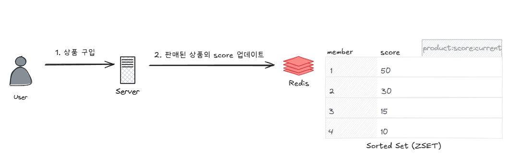
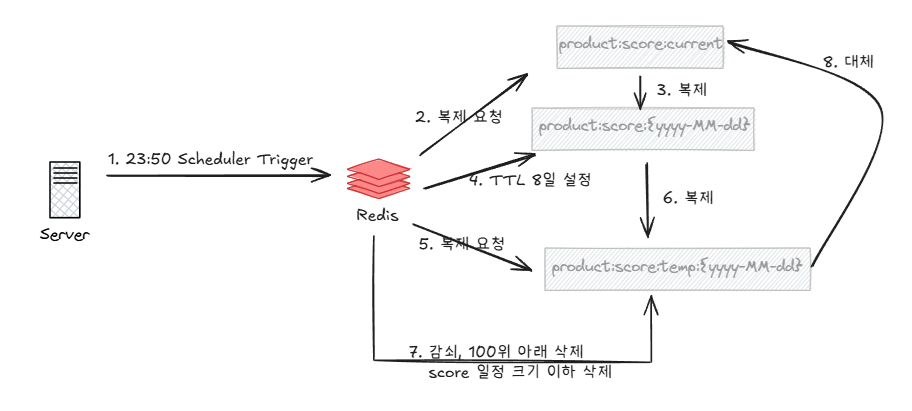
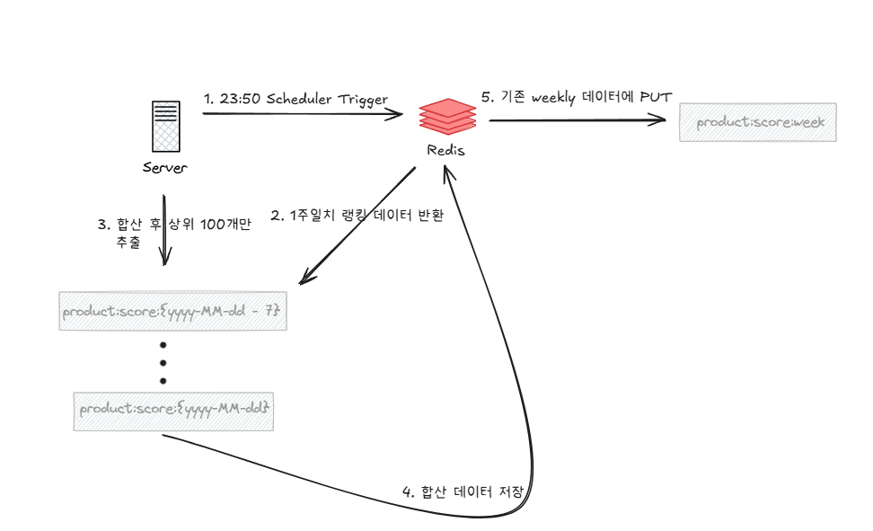

# Redis 디자인 아키텍처 보고서

## Redis 설계 적용 대상
### 인기 상품 조회
기존에는 매일 상당한 시간이 걸리는 쿼리를 돌려서 redis 캐시에 저장하고 이를 전달하도록 하였음  
당연하게도, DB 계산에 상당한 부하가 걸리게 되고, 따로 통계 테이블을 두지 않았기 때문에, 조회하고자 하는 기간이 길어질수록 조회 딜레이가 길어지고, DB CPU 부하가 심해지게 된다  
Redis 에서 상품 판매 랭킹 집계, 조회를 지원하여, 고성능으로 cpu 를 최대한 덜 사용하는 방향으로 인기 상품을 이용자에게 보여주고자 한다.

### 선착순 쿠폰 발급 및 조회
선착순 쿠폰은 단시간에 상당히 많은 유저가 몰려서 서버와 DB 인스턴스에 부하를 줄 수 있었다. 동시성 제어를 하기 위해 락을 사용하였고, 이는 당연하게도 성능 저하로 이어지게 된다.  
게다가, 락을 사용하는동안, 다른 서비스도 락에 영향을 받으므로, 전반적인 성능에 영향을 미친다  
Redis 의 자료구조를 적극적으로 활용하여, 락에서 자유로운 서버를 만들고, 동시성 이슈가 없도록 쿠폰을 빠르게 원하는 수량만 제공하도록 설계한다  

## 랭킹 디자인 설계
**랭킹 시스템은 "어제 집계 결과" 를 유저에게 노출**
### 랭킹 자료구조
| Redis Key 형태                 | 설명                | 자료구조 (Redis 타입)       | 비고                   |
|:-----------------------------|:------------------| :-------------------- |:---------------------|
| `product:score:current`      | 상품 당일 점수 (집계용)    | **Sorted Set (ZSET)** | 유저에게 직접 노출되지 않음  |
| `product:score:{yyyy-MM-dd}` | 상품 일간 판매 점수 (노출용) | **Sorted Set (ZSET)** | 상품 ID를 score 기준으로 정렬 |
| `product:score:week`         | 상품 주간 판매 점수 (노출용) | **Sorted Set (ZSET)** | 상품 ID를 score 기준으로 정렬 |

### 일간 랭킹 설계

- 매일 23:50 스케줄러 동작
  - current -> today 로 복제
    - today 데이터는 00시부터 랭킹 조회에 사용될 테이블
    - TTL 8일 설정
  - today -> temp 테이블 복제
    - temp 에 상위 100개, 임계값 이하 score 키 삭제, 감쇠 정책 적용 (0.5배)
  - temp 를 current 로 복제
- 50분 ~ 새로운 current 가 생기기까지 판매 점수는 무시
  - 일부가 무시되도 랭킹에 크게 영향이 없을것이라고 판단됨
- 상품 판매시 5점씩 up
  - 조회시 1점씩 up 시키려고 했으나, 대용량 요청시 부담이 되어서 일단은 제거

### 주간 랭킹 설계

- 매일 23:50 스케줄러 동작
- 기존 랭킹 데이터 삭제

## 쿠폰 디자인 설계
### 쿠폰 설계
[이미지]

### 쿠폰 자료구조
| Redis Key 형태              | 설명                  | 자료구조 (Redis 타입)   | 비고                        |
| :------------------------ | :------------------ | :---------------- | :------------------------ |
| `coupon:info:{couponId}`  | 쿠폰 상세 정보 저장         | String            | JSON 직렬화된 쿠폰 데이터          |
| `coupon:stock:{couponId}` | 쿠폰 남은 재고 수량         | Integer | 수량 감소할 때 사용               |
| `coupon:issued:{userId}`  | 유저별 발급 쿠폰 목록 및 사용여부 | Hash (Map)        | couponId → 0(미사용), 1(사용됨) |

