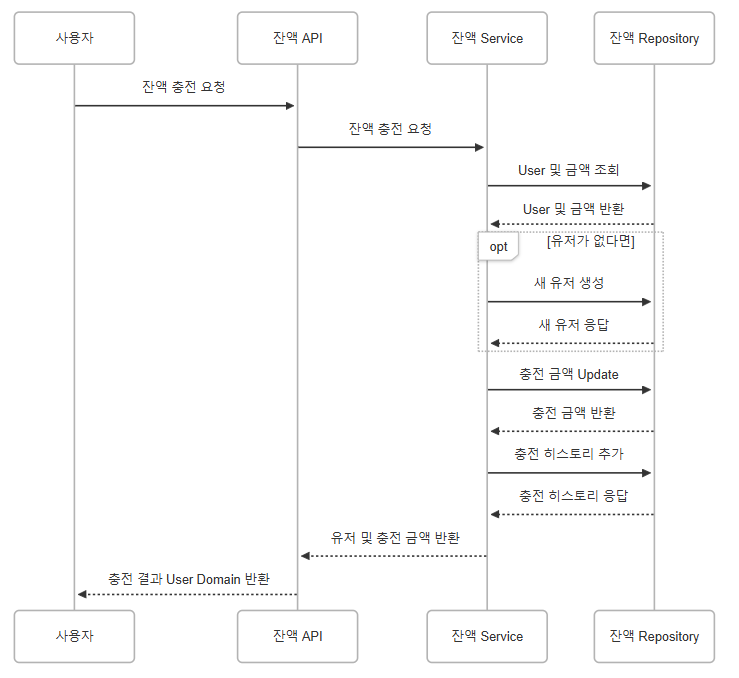
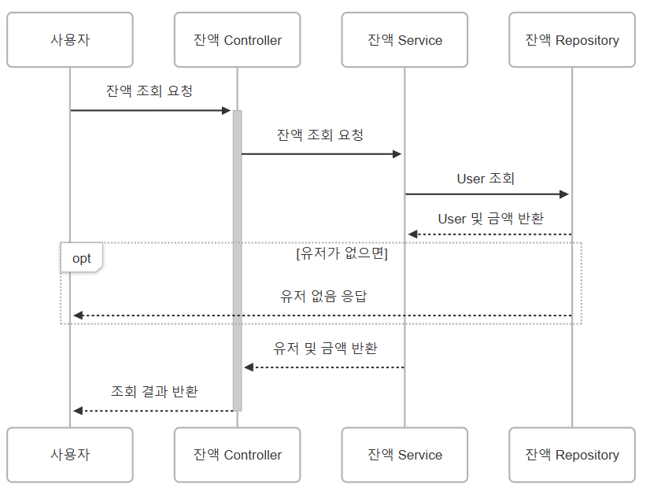
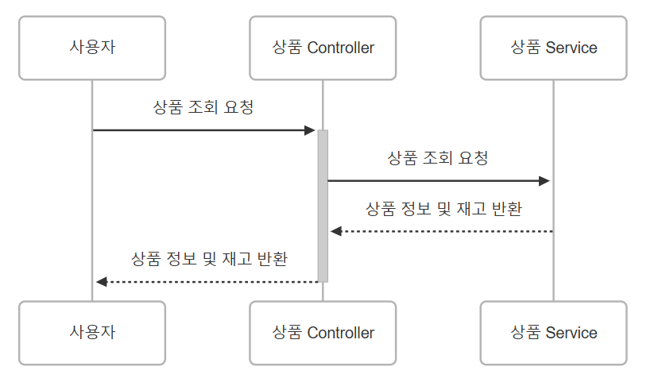
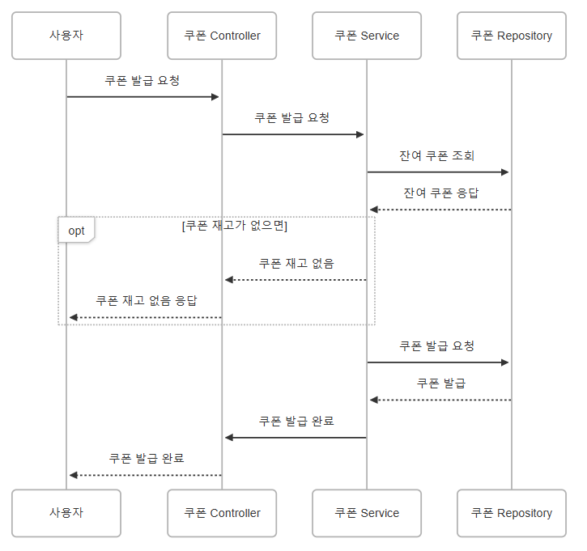
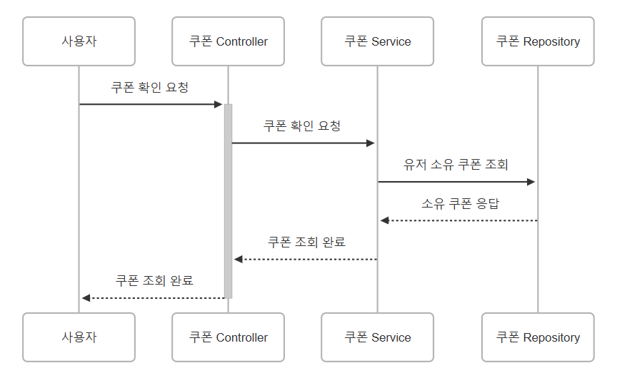
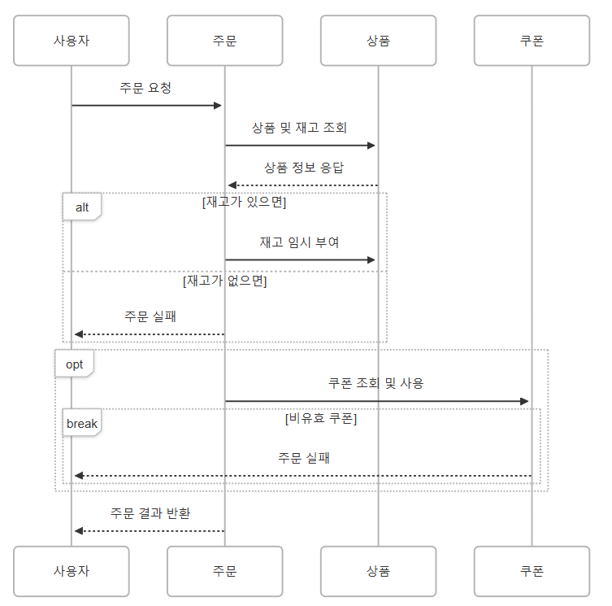
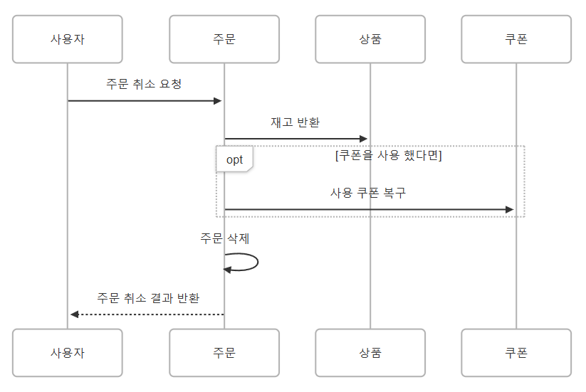
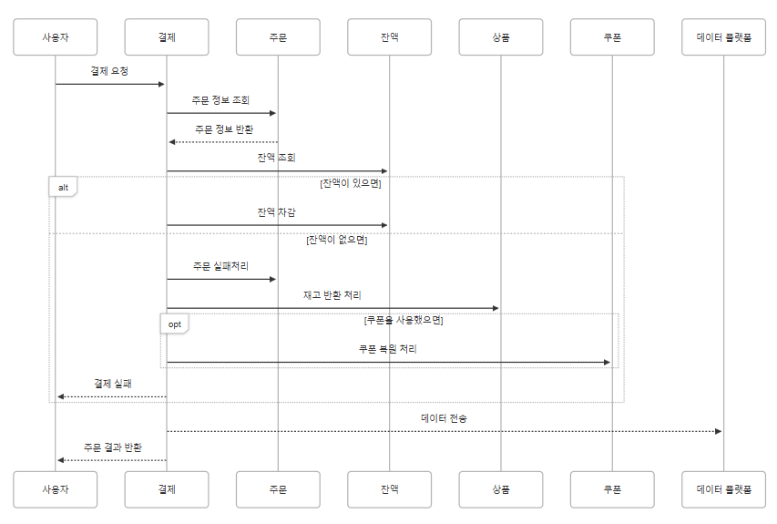
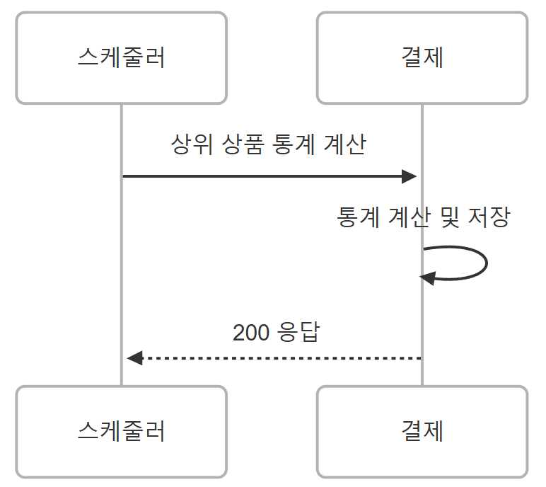
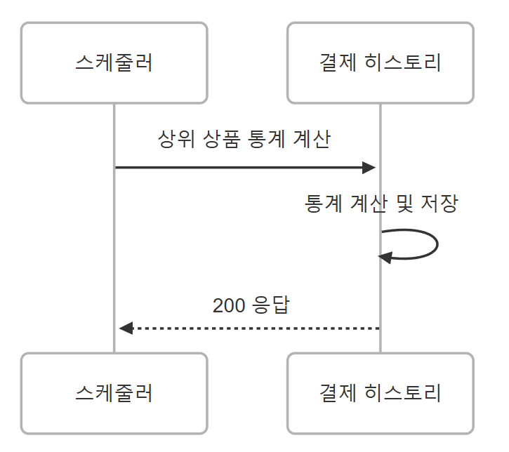

## 잔액 충전 시퀀스 다이어그램

```
sequenceDiagram
  participant P0 as 사용자
  participant P1 as 잔액 API
  participant P2 as 잔액 Service
  participant P5 as 잔액 Repository

  P0 ->>+ P1: 잔액 충전 요청
  P1 ->> P2: 잔액 충전 요청
  P2 ->> P5: User 및 금액 조회
  P5 -->> P2: User 및 금액 반환
  opt 유저가 없다면
    P2 ->> P5: 새 유저 생성
    P5 -->> P2: 새 유저 응답
  end
  P2 ->> P5: 충전 금액 Update
  P5 -->> P2: 충전 금액 반환
  P2 -->> P1: 유저 및 충전 금액 반환
  P1 -->>- P0: 충전 결과 User Domain 반환
```

## 잔액 조회 시퀀스 다이어그램

```
sequenceDiagram
  participant P0 as 사용자
  participant P1 as 잔액 Controller
  participant P2 as 잔액 Service
  participant P3 as 잔액 Repository

  P0 ->>+ P1: 잔액 조회 요청
  P1 ->> P2: 잔액 조회 요청
  P2 ->> P3: User 조회
  P3 -->> P2: User 및 금액 반환
  opt 유저가 없으면
    P3 -->> P0: 유저 없음 응답
  end
  P2 -->> P1: 유저 및 금액 반환
  P1 -->>- P0: 조회 결과 반환
```

## 상품 및 목록 조회 시퀀스 다이어그램

```
sequenceDiagram
  participant P0 as 사용자
  participant P1 as 상품 Controller
  participant P2 as 상품 Service

  P0 ->>+ P1: 상품 조회 요청
  P1 ->> P2: 상품 조회 요청
  P2 -->> P1: 상품 정보 및 재고 반환
  P1 -->>- P0: 상품 정보 및 재고 반환
```

## 선착순 쿠폰 발급 시퀀스 다이어그램

```
sequenceDiagram
  participant P0 as 사용자
  participant P1 as 쿠폰 Controller
  participant P2 as 쿠폰 Service
  participant P3 as 쿠폰 Repository

  P0 ->> P1: 쿠폰 발급 요청
  P1 ->> P2: 쿠폰 발급 요청
  P2 ->> P3: 잔여 쿠폰 조회
  P3 -->> P2: 잔여 쿠폰 응답
  opt 쿠폰 재고가 없으면
    P2 -->> P1: 쿠폰 재고 없음
    P1 -->> P0: 쿠폰 재고 없음 응답
  end
  P2 ->> P3: 쿠폰 발급 요청
  P3 -->> P2: 쿠폰 발급
  P2 ->> P1: 쿠폰 발급 완료
  P1 -->> P0: 쿠폰 발급 완료
```

## 쿠폰 조회 시퀀스 다이어그램

```
sequenceDiagram
  participant 사용자 as 사용자
  participant Controller as 쿠폰 Controller
  participant P1 as 쿠폰 Service
  participant P2 as 쿠폰 Repository

  사용자 ->>+ Controller: 쿠폰 확인 요청
  Controller ->> P1: 쿠폰 확인 요청
  P1 ->> P2: 유저 소유 쿠폰 조회
  P2 -->> P1: 소유 쿠폰 응답
  P1 -->> Controller: 쿠폰 조회 완료
  Controller -->>- 사용자: 쿠폰 조회 완료
```


## 주문 시퀀스 다이어그램

```
sequenceDiagram
  participant P0 as 사용자
  participant P1 as 주문
  participant P2 as 상품
  participant P3 as 쿠폰

  P0 ->> P1: 주문 요청
  P1 ->> P2: 상품 및 재고 조회
  P2 -->> P1: 상품 정보 응답
  alt 재고가 있으면
    P1 ->> P2: 재고 임시 부여
  else 재고가 없으면
    P1 -->> P0: 주문 실패
  end
  opt 
    P1 ->> P3: 쿠폰 조회 및 사용
    break 비유효 쿠폰
      P3 -->> P0: 주문 실패
    end
  end
  P1 -->> P0: 주문 결과 반환
```

## 주문 취소 시퀀스 다이어그램

```
sequenceDiagram
  participant P0 as 사용자
  participant P1 as 주문
  participant P2 as 상품
  participant P3 as 쿠폰

  P0 ->> P1: 주문 취소 요청
  P1 ->> P2: 재고 반환
  opt 쿠폰을 사용 했다면
    P1 ->> P3: 사용 쿠폰 복구
  end
  P1 ->> P1: 주문 삭제
  P1 -->> P0: 주문 취소 결과 반환
```

## 결제 시퀀스 다이어그램

```
sequenceDiagram
  participant P0 as 사용자
  participant P1 as 결제
  participant P2 as 주문
  participant P3 as 잔액
  participant P4 as 잔액
  participant P5 as 쿠폰
  participant P6 as 데이터 플랫폼

  P0 ->> P1: 결제 요청
  P1 ->> P2: 주문 정보 조회
  P2 -->> P1: 주문 정보 반환
  P1 ->> P3: 잔액 조회
  alt 잔액이 있으면
    P1 ->> P3: 잔액 차감
  else 잔액이 없으면
    P1 ->> P2: 주문 실패처리
    P1 ->> P4: 재고 반환 처리
    opt 쿠폰을 사용했으면
        P1 ->> P5: 쿠폰 복원 처리
    end
    P1 -->> P0: 결제 실패
  end
  P1 -->> P6: 데이터 전송
  P1 -->> P0: 주문 결과 반환
```

## 상위 상품 조회 시퀀스 다이어그램

```
sequenceDiagram
  participant P0 as 사용자
  participant P1 as 상품

  P0 ->> P1: 상위 상품 조회 요청
  P1 -->> P0: 상위 5개 상품 응답
```

## 상위 상품 통계 계산 시퀀스 다이어그램

```
sequenceDiagram
  participant P0 as 스케줄러
  participant P1 as 결제 히스토리

  P0 ->> P1: 상위 상품 통계 계산
  P1 ->> P1: 통계 계산 및 저장
  P1 -->> P0: 200 응답
```
