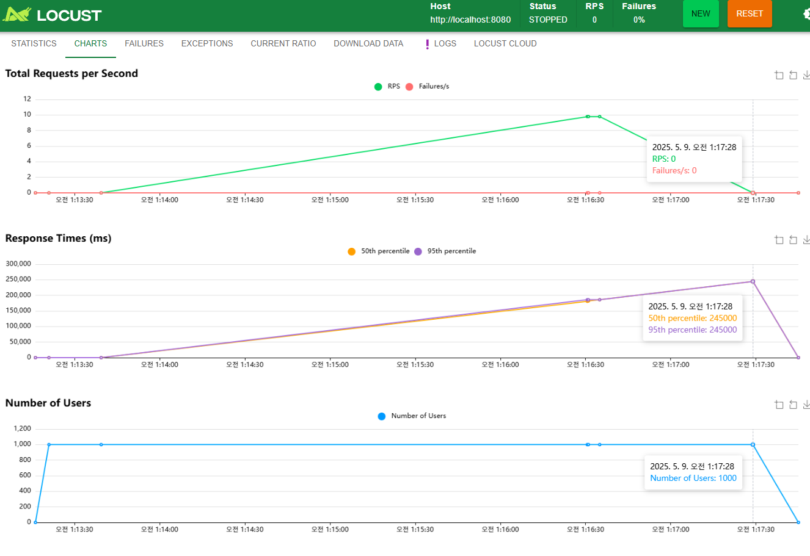

# 캐싱 전략 설계

## 캐시 읽기 전략
### 1. Look Aside

데이터를 찾을 때 먼저 redis cache 에서 search 를 진행하고, 데이터가 존재하면, 데이터를 가지고와서 응답하는 전략  
만약 캐시가 없으면 cache miss 가 발생하고, 이때 Database 에 접근하여 데이터를 가져 온 뒤, redis cache 에 해당 데이터를 저장 한다  
  
Redis 캐시에 찾는 데이터가 없을 때 DB 를 직접 조회하기 때문에 **Lazy Loading** 이라고 한다  

Redis 서버가 죽더라도, DB 에서 데이터를 가져올 수 있음  
하지만 DB 에 부하가 많이 발생할 수 있고, 네트워크 지연으로 인한 성능 감소가 발생할 수 있다.  

접근이 많이 발생 할 수 있는 데이터의 경우, 서비스 전에 미리 cache 하는 작업은 **Cache Warming** 이라고 한다

### 2. Read Through

캐시에서만 데이터를 읽어오는 전략  
Cache miss 가 발생하면, Redis 는 DB 에서 데이터를 검색하고 캐시에 자체 업데이트 한 뒤 앱에 데이터를 전달


## 캐시 쓰기 전략
### 1. Write Through

데이터를 저장할 때 먼저 캐시에 저장한 다음 DB 에 저장하는 방식  
캐시는 항상 최신정보를 가지게 되지만, Redis 에 먼저 저장을 해야 하므로, 상대적으로 느림
자주 사용하지 않는 데이터도 모두 Cache 되므로 리소스 낭비가 발생한다  
이를 방지 하기 위해 Expire time 을 설정

### 2. Write Back (or Write Behind)

먼저 캐시에 데이터를 저장했다가 특정 시점마다 DB 에 저장하는 방식  
DB 쓰기 비용을 절약 할 수 있지만, Redis 서버 상태에 문제가 발생시, 데이터 유실이 발생 할 수 있다.  
**조회수**, **좋아요 수**, **추천 수**, **로그 수집 후 배치 처리** 등등에 대표적으로 적용할 수 있다.   

### 3. Write Around

모든 데이터는 DB 에 저장, 읽은 데이터만 캐시에 저장  
Cache miss 가 발생하는 경우에만 캐시에 데이터를 저장. DB 내의 데이터와 다를 수 있음  
Look Aside, Read Through 와 결합하여 사용


#### Look Aside 와의 차이
| 구분          | Write-Around                    | Look-Aside (Lazy-Loading)  |
| ----------- | ------------------------------- |----------------------------|
| 캐시에 쓰는가?    | **쓰기 시 캐시에 쓰지 않음**, DB에만 씀     | **쓰기 시 캐시에 쓰지 않음**, DB에만 씀 |
| 캐시 로딩 시점    | 읽을 때 캐시에 없으면 DB에서 읽고 캐시에 저장     | 읽을 때 캐시에 없으면 DB에서 읽고 캐시에 저장 |
| 캐시 관리 주체    | **캐시 시스템**이 읽기 시점에 DB → 캐시 자동 처리 | **서비스 코드** 에서 명시적으로 캐시 제어  |
| 쓰기 직후 캐시 상태 | **반영되지 않음**      | **반영되지 않음**  |
| 장점          | 캐시 오염 방지, 쓰기 부담 감소              | 유연하고 코드 제어 가능, 사용한 데이터만 캐시됨 |
| 단점          | 읽기 시 캐시 미스가 많아질 수 있음            | 캐시 관리 로직이 코드에 섞여 유지보수 어려움  |


## 캐시 스탬피드 현상

대규모 서비스 환경 여러 서버가 동작하고 있을때, 캐시가 만료된 이후 **동시에** 동일한 데이터에 대한 요청이 일어날 때 발생  
모든 요청이 cache miss 가 발생하고, 여러대의 서비스에서 동시에 DB 에 만료된 데이터를 재요청  
DB 에 많은 요청이 쏠리게 되고, DB 과부하가 발생하게 되며, 심지어 DB 가 Down 되는 경우도 발생하게 된다  
결과적으로 서비스 성능 저하 발생  

### 해결 방안
#### 1. 적절한 만료 시간 설정
- 만료시간을 너무 짧게 설정하면 안됨
- 데이터 특성에 맞춰 적절히 설정

#### 2. 선 계산
- 데이터 만료가 되기 전에 미리 데이터를 가져와서 새로 Redis 에 갱신

#### 3. 확률적 접근
- 만료 시간이 가까울 수록 확률적으로 DB 에 접근해 데이터를 갱신
- **ttl - 랜덤 값** 이 0보다 작은 경우 캐시 만료가 임박했다고 판단하여 캐시 갱신

#### 4. PER 알고리즘
- 확률적 조기 재계산 (Probabilistic Early Recompilation) 알고리즘 사용
- ```ttl - (BETA * Math.log(randValue) * EXPIRY_GAP)```  
  캐시의 남은 만료 시간에 랜덤 값을 조정해 뺀 값을 계산하고, 해당 값이 0보다 크다면, 캐시가 유효하다고 판단함  

#### 확률적 접근 vs PER 알고리즘
| 항목         | 확률적 접근 방식                       | PER 알고리즘 (Probabilistic Early Recompute)     |
| ---------- | ------------------------------- | -------------------------------------------- | 
| **핵심 개념**  | 캐시 만료 시간을 랜덤하게 설정하여 만료 시점을 분산시킴 | 캐시 만료 전에 확률적으로 미리 갱신하여 스탬피드 방지               | 
| **적용 시점**  | 캐시 저장 시점에 랜덤한 TTL 부여            | 캐시 조회 시점에 확률적으로 갱신 여부 결정                     |
| **복잡도**    | 낮음 (간단한 랜덤 TTL 설정)              | 높음 (남은 TTL, 계산 시간, 확률 계산 등 고려)               |
| **장점**     | 구현이 간단하며 캐시 만료 시점을 분산시켜 스탬피드 완화 | 핫 키(Hot Key)에 대해 효과적으로 스탬피드 방지, 캐시 히트율 향상 가능 |
| **단점**     | TTL 설정만으로는 완벽한 스탬피드 방지 어려움      | 구현 복잡성 증가, 잘못된 확률 설정 시 오히려 부하 증가 가능성 있음      |
| **사용 예시**  | TTL을 300초 ± 60초로 랜덤 설정          | TTL이 임박한 캐시에 대해 확률적으로 미리 갱신 수행               |
| **적합한 상황** | 간단한 캐시 시스템, 구현 리소스가 제한된 경우      | 고트래픽 시스템, 핫 키가 자주 발생하는 환경                    |

---
## 캐싱 적용 및 개선  

### 1. 인기 상품 목록 조회
#### 캐싱 전략
- 6시간 기준 인기 상품 통계 처리
- 캐시 만료 전 미리 캐시를 갱신하도록 설계
  - **선 계산** 전략을 이용하여 캐시 스탬피드 현상 방지
  - TTL 은 370분 (6시간 10분) 으로 설정
    - 10분의 유예시간 추가
  - 각 Scheduler 는 6시간마다 동작하도록 설정
  - 동작 완료시 CachePut 을 이용하여 새로 갱신
```java
@Cacheable(value = "bestProducts", key = "'bestProducts'")
public List<ProductServiceResponse> getBestProducts() {
    log.info("============ " + "[Cache miss]" + " ============");
    List<Product> bestProducts = productRepository.findPopularTop5();

    return bestProducts.stream()
            .map(this::toResponseWithOptions)
            .toList();
}
```
캐시 조회를 실패하면, log 에 Cache miss log 를 찍도록 처리

E2E 테스트를 통해, 미리 캐시를 하고, getBestProducts 요청 후 캐시가 찍히지 않는 것 확인
```text
[Scheduler] Calculating best products
새 Request-ID 생성: 67d9b7cb-82ec-4631-ae12-b6c29b6e9303
[API 요청] GET /v1/products/bests
[감사 로그] URI: /v1/products/bests, Method: GET, IP: 127.0.0.1
[GET] /v1/products/bests 처리 시간: 56ms
[API 응답] /v1/products/bests → 상태코드: 200
```

### 2. 상품 목록 조회
#### 캐싱 전략
- 기본 30분 캐싱 처리
- page, size, sort 방식 을 key 로 사용하여 캐시
- 현재는 상품 등록이 되지 않아 따로 Evict 로직을 추가하지는 않음
  - 상품 등록 관련 api 가 존재한다면, productList value 로 저장된 모든 데이터 삭제하도록 처리
  - page 와 size 상관없이 모두 삭제하도록 처리하면 됨
```java
@Cacheable(
        value = "productList",
        key = "'productList::page=' + #requestDto.page() + ':size=' + #requestDto.size() + ':sort=' + #requestDto.sort()"
)
public List<ProductServiceResponse> getProductList(ProductListServiceRequest requestDto) {
    List<Integer> excludedStates = List.of(
            ProductStates.DELETED.getCode(),
            ProductStates.SOLD_OUT.getCode()
    );
}
```

### 3. 포인트 조회 / 충전 / 사용
#### 캐싱 전략
- user id 를 기반으로 user point 캐시
- 충전/사용 기능 사용시, cache evict 를 시켜서, 다음 조회시 DB 에서 포인트 읽어오도록 설정
- 단순 조회만 하게 될때 성능 극대화가 목표
```java
@Cacheable(value = "userPoint", key = "#root.args[0].userId()")
public UserPointServiceResponse getUserPoint(UserPointServiceRequest reqService)

@CacheEvict(value = "userPoint", key = "#root.args[0].userId()")
public PointChargeServiceResponse charge(PointChargeServiceRequest reqService)

@CacheEvict(value = "userPoint", key = "#root.args[0].userId()")
public PointUseServiceResponse use(PointUseServiceRequest reqService)
```

### 4. 장바구니 조회 / 추가 / 결제
- user id 를 기반으로 장바구니 캐시
- 장바구니 아이템 추가 / 장바구니 결제시, cache evict 처리, 다음 조회시 DB 에서 장바구니 정보 읽어오도록 설정
```java
@Cacheable(value = "userCart", key = "#root.args[0].userId()")
public CartItemServiceResponse getCart(GetCartServiceRequest request)

@CacheEvict(value = "userCart", key = "#root.args[0].userId()")
public AddCartServiceResponse addCartService(AddCartServiceRequest request)

@CacheEvict(value = "userCart", key = "#root.args[0].userId()")
public CreateOrderServiceResponse createOrder(CreateOrderServiceRequest requestDto)
```

### 5. 쿠폰 조회 / 발급
- user id 를 기반으로 쿠폰 캐시
- 새 쿠폰을 발급 받으면, Cache Evict 처리, 다음 조회시 DB 에서 장바구니 정보 읽어오도록 설정
```java
@Cacheable(value = "getCoupon", key = "#root.args[0].userId()")
public GetCouponsServiceResponse getCoupons(GetCouponsServiceRequest request)

@CacheEvict(value = "getCoupon", key = "#root.args[0].userId()")
public IssueNewCouponServiceResponse issueNewCoupon(IssueNewCouponServiceRequest request)
```

---

# 성능 테스트
## 인기 상품 조회 성능 테스트
대표적으로 성능 문제가 발생할 수 있는, 인기 상품 조회에 대한 성능 테스트를 진행  
Redis 가 있을때와 없을때, 성능 측정을 통해 Redis 의 존재가 얼마나 효율적인지를 보여주고자 한다

- 요청 유저 수: 1,000 명
- 인기 상품 조회 API에 유의미한 시간동안 부하 테스트 진행
- **100만개**의 데이터를 샘플로 진행

### Redis Cache 존재 시

Look ALike 전략으로 인해, 최초 요청시 다소 응답이 지연되는 경향이 있었지만, 그 이후로 대체로 1~5 ms 내에서 응답 처리  
redis 성능 극대화 처리 되고 있는것을 확인

### Redis Cache 제거 후



인기 상품 query 처리에 docker 에 건 제약의 최대치를 다 쓰게 되고, 응답시간이 매우 지연됨을 확인 할 수 있음  
db 부하가 급격하게 증가하게 되고, 응답시간도 선형적으로 증가함을 확인 할 수 있음  
최소 100초 ~ 300초 이상까지 지연이 발생하고, 심지어, db pool 자원과 Server 의 연결 최대수를 넘어가서 request 자체가 Fail 나는 경우도 발생  

## 결론
- Redis 의 존재는 없어서는 안될 필수적인 존재임을 확인
- 인기상품과 같은 DB 계산에 많은 연산을 필요로 하는 쿼리의 경우, 쿼리를 최소화 하는것이 필수  
- redis 를 사용하지 않는다면, 최소한 local cache 를 활용해야함  
- 캐시 스탬피드가 발생한다면, 반드시 서버 장애로 이어지기 때문에, 캐시 스탬피드를 해결할 수 있는 방안을 반드시 마련해야 함


---

# Reference
- [캐시(Cache) 알아보기-yoongrammer](https://yoongrammer.tistory.com/101)
- [캐시 스탬피드](https://velog.io/@qkrtkdwns3410/%EA%B0%9C%EB%B0%9C%EC%9E%90%EB%A5%BC-%EC%9C%84%ED%95%9C-%EB%A0%88%EB%94%94%EC%8A%A4-%EC%BA%90%EC%8B%9C-%EC%8A%A4%ED%83%AC%ED%94%BC%EB%93%9C-%ED%98%84%EC%83%81)
- **Chat GPT**
